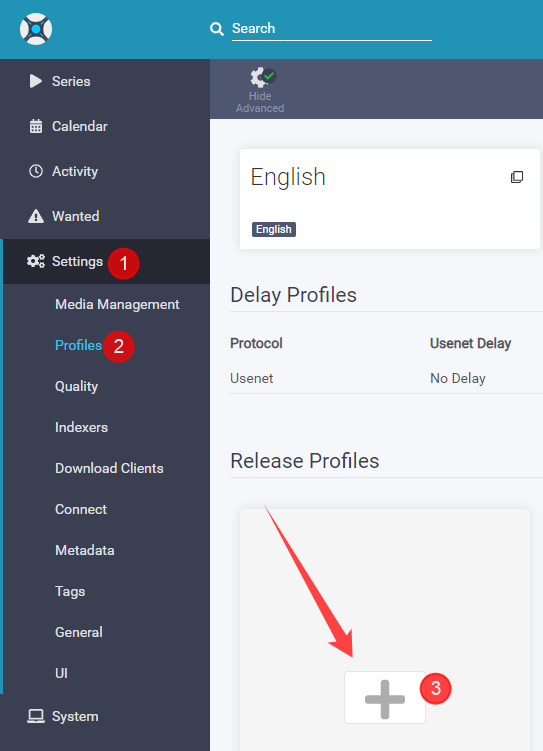

### Sonarr Release Profile RegEx (WEB-DL)

(*the regex isn't mentioned anywhere, it's a hidden advanced feature*)

------

Sonarr V3 has a great feature called Release Profile.
With this option you can fine tune your preference.

The Release profile that we're going to use for this example is mainly to prefer P2P releases over Scene releases, (Scene releases are still being downloaded but upgraded)
Why ?
Scene release always release in a rush to bring it out as fast as possible,
so I noticed  often that I got Repacks/Proper releases from them or from different groups and quality.
P2P releases are a bit smarter and work sort of together by not doing the same release.
Also I noticed that with some Scene releases the 5.1 audio was stripped out or converted to AAC audio.
And in my opinion the P2P are of better quality.
Theirs 1 Scene releaser that do bring out quality releases `-deflate/-inflate` 

**Update**
A large portion of Amazon WEB-DLs in the last week have only had 192Kbps DD+5.1, because that's all Amazon made available initially. 
The proper 640Kbps DD+5.1 audio might appear a few hours later or a few months, but when they get updated the episodes will be REPACKed.

### Propers and Repacks

First we're need to make sure a P2P release isn't being replaced by a Scene Repack/Proper release !


Settings => `Media Management`
Where we going to set it to `Do not Prefer`


Then we navigate in Sonarr to the Settings =>  `Profiles`




Then you will get a popup screen that will look like this =>


`Must Contain` => add words that the release name **MUST HAVE!** 

`Must Not Contain` => add words that the release name **MUST NOT HAVE AND SO TO BE IGNORE!**

`Preferred`=> add words you prefer with a certain score what you prefer more or upgrade.

`Tags` => create a tag so this is only used by shows that you give this tag or else it's global.


We're only to make use of options 2 and 3.
The Number between the **[**brackets**]** are the scores the release name will get during a automatic and manual search and with the use of the scores some releases will be preferred over others and even upgraded.

***Keep in mind this list will be a constant work in progress because I will be updating it when it's needed***
***So best to set a notification for updates for this page.***

### Sonarr Release Profile RegEx

```markdown
# Sonarr Release Profile RegEx
# This list is made by collecting information from Sonarr Discord Channel,
# and personal testing and a few others that helped.
# So I want to thnx everyone who helped to make this list possible,
# For privacy reasons I decided not to add the names/nick of the persons.
# If you want to be mentioned please message me on discord,
# including a link for proof to what part you want to be credited.


# Must Not Contain
/(x|h)\.?265/i

# Preferred
 [100]   /(amzn|amazon).?web.?dl/i
  [90]   /(nf|netflix).?web.?dl/i
  [90]   /(dsny|disney).?web.?dl/i
  [80]   /(-deflate|-inflate)/i
  [75]   /(hulu|.?hbo\.?)/i
  [75]   /(red).?web.?dl/i
  [75]   /(iT).?web.?dl/i

  [50]   /(-BTN|-NTb|-NTG|-CasStudio|-QOQ|-KiNGS)/i
  [50]   /(-AJP69|-ViSUM|-TOMMY|-monkee|-CtrlHD)/i
  [25]   /(-SIGMA|-NYH|-TVSmash|-TEPES|-SA89)/i

  [10]   /(repack|proper)/i

  [-25]  /(-xpost|-postbot|-Obfuscated|-Rakuv|-GEROV)/i
  [-25]  /(-Scrambled|-WhiteRev|-AsRequested|-4P)/i
  [-25]  /(-NZBGeek|-BUYMORE|-Chamele0n|-4Planet)/i
  [-25]  /(-iNC0GNiTO)/i
  [-25]  /(\[rartv\]|\[eztv\]|\[TGx\])/i

  [-50]  /(-AMCON|-AMRAP|-BAMBOOZLE)/i
  [-50]  /(-ION10|-METCON|-MEMENTO|-EDHD)/i
  [-50]  /(-POKE|-STRiFE|-WEBTiFUL|-TRUMP)/i
  [-50]  /(-STARZ)/i
  
 [-100]  /(TBS|-BRiNK|-CHX|-XLF)/i

# Optional (matches releases that ends with EN) 
  [-25]  /\s?\ben\b$/i
# Optional Matches any release that contains '1-' as prefix for Release Groups
  [-25]  /(1-.+)$/i
```

A little explanation of the scores and why,
Scores [75]-[100] Release Source.
Scores [25]-[50] P2P Groups.
Scores [10] Give a repack/proper a higher score but don't trump P2P groups for a Scene fix.

Scores [-25] Retagged/Renames/Obfuscated  releases.
Scores [-50] Scene groups.
Scores [-100] Groups that mess with the audio or add another preferred language.


Optional => We've tested it and it worked for what we've tested it on, if it will work in your situation we don't know if you notice something wrong just contact me and we will try to fix it or remove it.


The reason why I got multiple entry's with the same score is because the line will go out of the box and i don't like how that looks. 

When you've done it correctly it will look something like this.


### Why Not x265
Then the question why I put `/(x|h)\.?265/i` as `Must Not Contain`.
Luckily someone else on Discord described it nice and correctly in my opinion.

```
x265 is good for 4k remuxes.
If the media isn't source quality/remux, then there will be a loss of quality every time.
Also, once you go x265, typically that file is done.
It can't be changed to something else without a huge loss of quality.

Something like 95% of video files are x264 and have much better direct play support.
If you have more than a couple users,
you will notice much more transcoding.
Just depends on your priorities.

So basically if you are storage poor and just need to save space, use x265.
The catch is if you want best quality x265, you need source quality files, so you still have huge file sizes.
If you want maximum compatibility and the option to change your files to something else later,
then x264.
It's all really dependent on specific situations for different people
```

So if you care less about quality then remove the part,
or just don't use the list. 