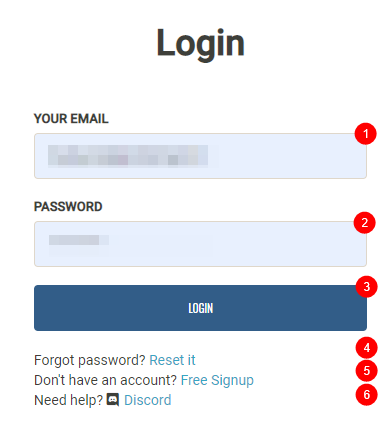
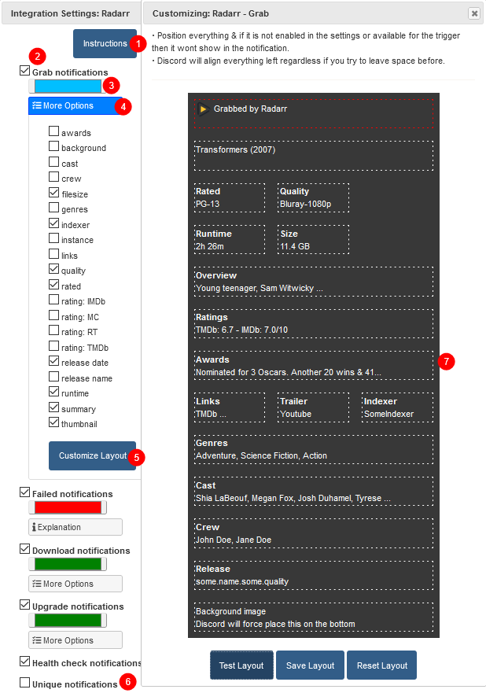
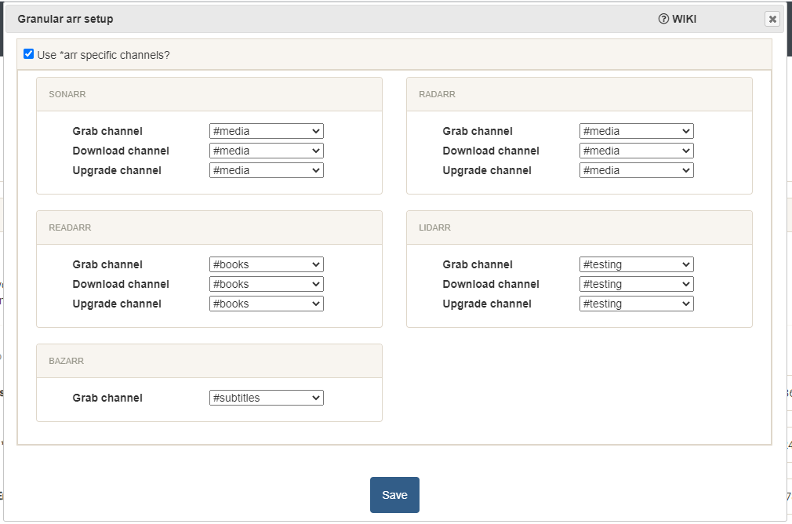
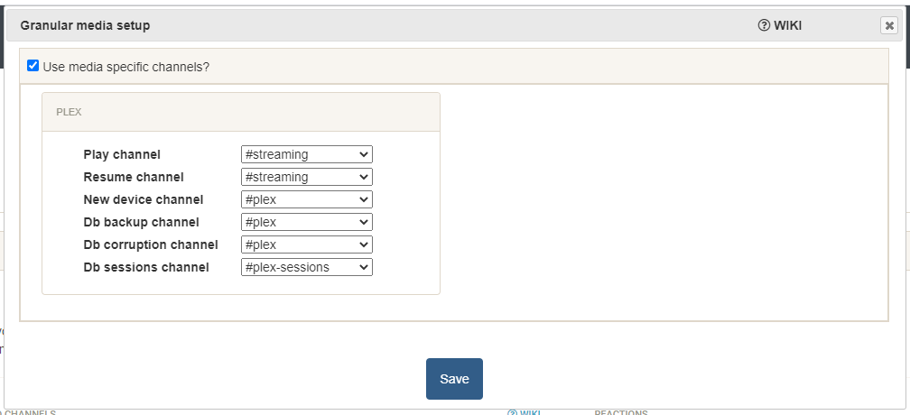
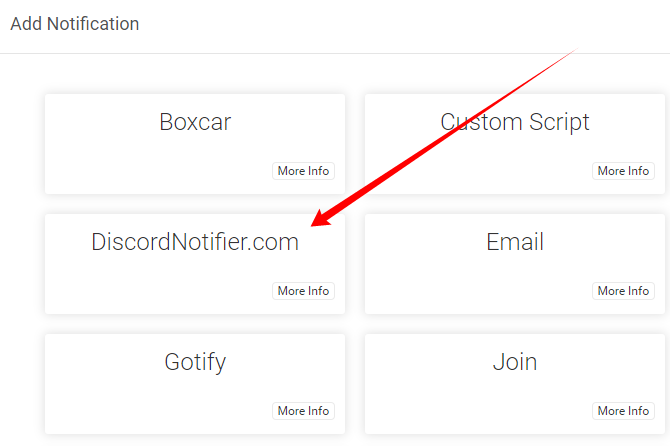
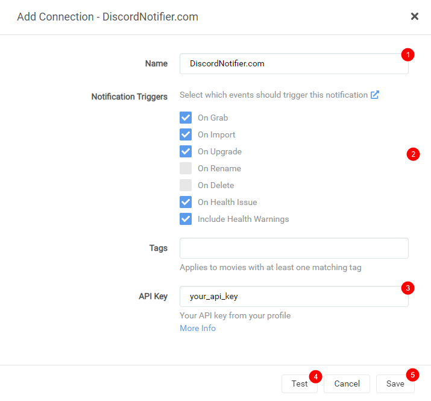
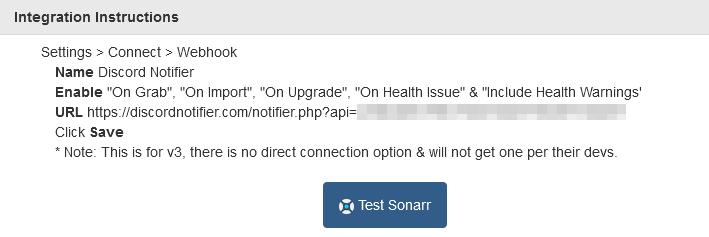
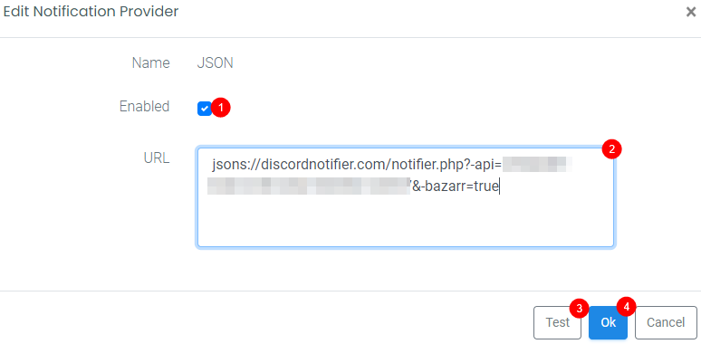
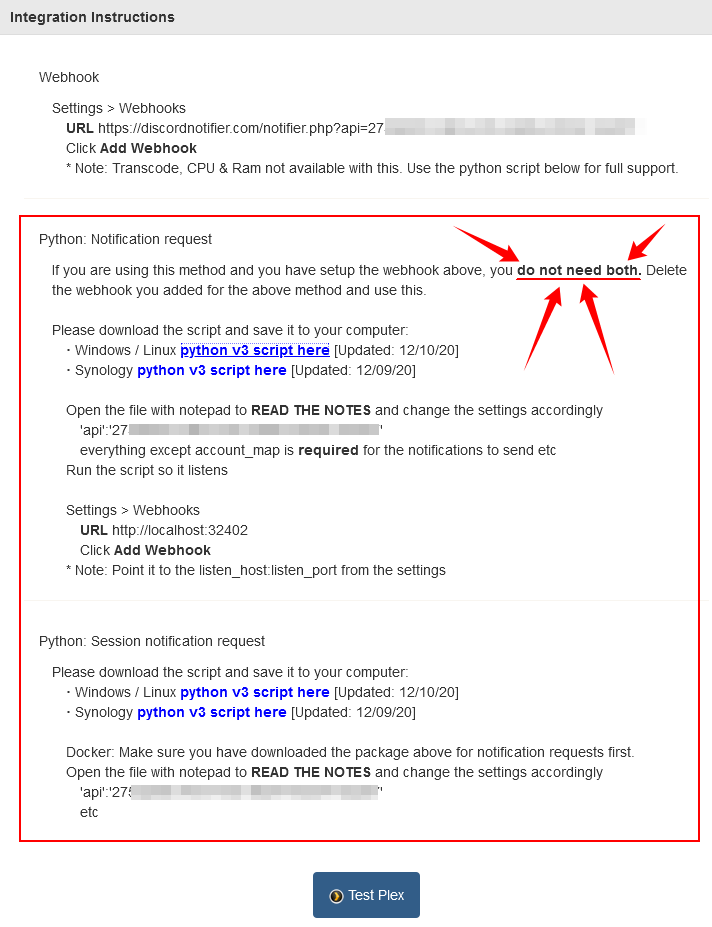

<style>
.indent-L1 {
    margin-left: 1em;
}
.indent-B1 {
    margin-bottom: 1em;
}
</style>

# Discord Notifier Basic Setup

Here you will see a basic setup for Discord Notifier.

------

## Login

First we're going to visit the [Discord Notifier](https://discordnotifier.com/index.php){:target="_blank"} site, if you don't have an account yet, click the link to signup.

 

1. Your Email address you used during signup.
1. Your Password you created during signup.
1. Login to the site and setup.
1. Password reset if you forgot your password.
1. Signup if you don't have an account.
1. Link to Discord Notifier Discord support channel.

------

## Profile

After you have logged in, you will be redirected to your profile screen.

 

1. Select your Country.
1. Select your Timezone.
1. Click on `Generate API Key` (This needs to be done).
1. Change your Time Format to your liking.
1. Don't forget to Save your Changes.

------

## Notification Setup

Here, you can setup the following items:

- Notifications Settings => Setup which notifications you want to receive.
- Discord Settings => Setup your discord channels and your reactions and invite the bot into your channel.

### Notification Settings


First, click on  `Manage Integrations` so you can enable what you want to receive notifications for.


A screen will popup and here you're able to select from which application/service you receive a notification.

When you enabled the ones you want click on `Save`

Setup which notifications you want to to receive from each option.

 

1. Click on the cog (settings) icon to configure what will be in your notification.

??? example "Notification Settings Configuration"

    #### Notification Settings Configuration

    

    1. [Instructions how to integration the notifications](#integrations)
    1. Enable/Disable notification trigger
    1. Change color bar for notification trigger
    1. Expand trigger to enable/disable message fields
    1. Customize the layout for the notification (drag/drop editor to the right in the image)
    1. Enable so each notification is unique and wont update existing ones.
    1. Here you can edit the layout

### Discord Settings

<div class="indent-L1 indent-B1">
Setup your discord channels and your reactions and invite the bot into your channel.
</div>

#### Create the channels

<div class="indent-L1 indent-B1">
First thing to do is create a few channels where you receive your notifications.

!!! note:
    I won't be explaining how to setup a discord channel, that's up to you but google has plenty of references.

You can do it all from one channel or separate the notifications (granular) for each trigger if you want.
</div>

#### Simple channel setup

`#media` => All the `*arr` notifications you setup in [Notification Settings](#notification-settings).

`#errors` => Health checks, network errors, etc.

`#plex` => Play, resume, etc. for Plex.

After you create the needed channels, it's time to add them to the `Setup the channels`

First we need to get the channel ID's from your server/channel

Open your User Settings -> Appearance -> Enable Developer Mode.

 

 Right click on the Discord text channel you want the bot to interact  with and press "Copy ID"

 

Paste the channel ID in the corresponding boxes.

 

1. Add the channel ID for the `#media` channel.
1. Add the channel ID for the `#errors` channel.
1. Add the channel ID for the `#plex` channel.
1. Use this option if you want to use separate channels for the notifications (see below).
1. Use this option if you want to use separate channels for the notifications.

??? example "Granular arr setup"

    ##### Granular arr setup

    

??? example "Granular media setup"

    ##### Granular media setup

    

### Invite the bot

It's time to invite the bot in to your Server/Channels by clicking on the following link.

 

You will get a screen that looks like the following screenshot.

 

1. Select the server the bot should join.
1. Click on `Authorize` to approve.

!!! note:
     You have to be an administrator of the Discord channel to invite bots. Make sure the bot has permissions to post.

??? summary "Bot Setup Help"
    Right click on your server > Server Settings > Roles

    If you have a Bot role you can skip this, otherwise click the + next to ROLES

    Name the role Bot and scroll down to Text Permissions.

    Enable `Send Messages`, `Embed Links` & `Add Reactions`

    Go back to your server, right click on the Media Bot and assign the role of Bot

#### Reactions

Here we will setup the Discord Notifier reactions(emoji's) that will be shown during a playback in plex, or during a download/import in Sonarr/Radarr.

 

This section exist of 2 parts.

1. *arr state (grab/failed) and play state of plex.
1. The Trackers/Indexers.

First we're going to download the emoji's and you can do that in 2 ways.

1. 1 at a time - Right click -> Save As... - for these emoji images to some location on your computer.
1. Pack Download - Click [here](https://discordnotifier.com/setup.php?grab=reactions){:target="_blank"} to download a zip of all the current reaction images.

For this example, we will be using Pack Download.  You'll need download the file and then unpack it somewhere on your computer.  After which, you can then add the emoji's to your Discord Server easily.

How to add your own Emoji's => [LINK](https://support.discord.com/hc/en-us/articles/360036479811-Custom-Emojis){:target="_blank"}

After you've added them to your Discord Server it's time to get the ID's from your emoji's, to do this go in to one of your channels and type:

```bash
\:emoji_name:
```

??? example "Example"
    

    What results in to.

    

    So your ID would be `:grab:706535455876710461`.

Paste the ID results from your channel in to the corresponding boxes.

 

Do this for all the other boxes also including your Trackers/Indexers.

#### Trackers and Indexers

 

1. Paste here the the emoji ID.
1. The actual indexer name you're using in Sonarr/Radarr.

??? example "Example"

    

    What will result in to.

    

    If you use a different name in Sonarr and Radarr just add them with a comma `BeyondHD - Jackett,BHD`.

Don't forget to click on `Save Changes` !!!

!!! note
    After pasting the Emoji's ID in to the box you will notice that the leading colon will disappear nothing to worry about that's per design

------

## Integrations

Here we will explain how to we add all this to your *arr and Plex.

 

### Radarr, Readarr and Lidarr

Radarr, Readarr and Lidarr supports Discord Notifier natively so that's an easy one to add.

`Settings` => `Connect` => click on  and select `Discord Notifier` add your API key and you're done.

??? example "Radarr Example"
    In Radarr go to `Settings` => `Connect` => Click on  and select `DiscordNotifier.com`.

    

    Then add the following info.

    

    1. The name you want to use for the notification.
    1. Enable `On Grab`, `On Import`, `On Upgrade`, `On Health Issue` & `Include Health Warnings`.
    1. Add here you API key from Discord Notifier.
    1. Click on `Test` to see if it works.
    1. If everything is correct click on `Save`

### Sonarr

Sonarr doesn't have native support & will not get one per their devs.
That's why we're going to use the webhook method.

 

`Settings` => `Connect` > Click on  and select `Webhook`.

Add the following info:

**Name**: Discord Notifier

**Enable:** `On Grab`, `On Import`, `On Upgrade`, `On Health Issue` & `Include Health Warnings`.

**URL:** The URL that you can copy/paste from the integrations page.

Click **Save**

??? example "Sonarr Example"

    `Settings` => `Connect` > Click on  and select `Webhook`.

    

    Add the following info.

    

    1. The name you want to use for the notification.
    1. Enable `On Grab`, `On Import`, `On Upgrade`, `On Health Issue` & `Include Health Warnings`.
    1. Add the URL that you can copy/paste from the integrations page.
    1. Make sure this is on `POST`.
    1. Click on `Test` to see if it works.
    1. If everything is correct click on `Save`

### Bazarr

For Bazarr you need to make use of JSON method.

 

`Settings` => `Notifications` => and select`JSON`

On the top click on  icon and Enable the notification type.

Add the JSON URL that you copy/pasted from the integrations page.

Scroll up and save

??? example "Bazarr Example"

    `Settings` => `Notifications` => and select`JSON`

    

    On the top click on  `Edit` icon and Enable the notification type.

    Add the following info.

    

    1. Enable the JSON Notification.
    1. Add the JSON URL that you copy/pasted from the integrations page.
    1. Click on `Test` to see if it works.
    1. If everything is correct click on `Ok`

    Don't forget to click on Save on the top of the Bazarr screen.

    

### Plex

#### URL Webhook

 

`Settings` => `Webhooks` => click on `ADD WEBHOOK` and add the URL that you can copy/paste from the integrations page and click on `SAVE CHANGES`

??? example "Plex Example"

    `Settings` => `Webhooks` => click on `ADD WEBHOOK`

    On the top right click on the  `Settings` icon, and on the left sidebar select `Webhooks`
    Click on the middle of the screen on  and add the following info.

    

    1. Add the URL that you can copy/paste from the integrations page.
    2. Click on `SAVE CHANGES`

??? info "Advanced Plex Settings"

    ### Advanced Plex Settings

    

    #### Python Webhook

    <div class="indent-L1 indent-B1">
    Python is required for this to work. Make sure your docker solution has it available if running docker.
    </div>

    #### All implementations

    - Open the file and change the variables accordingly.
    - There are links in the file comments to help as well
    - You can test the script by typing python /path/to/script in your CLI. If the file has a shebang in it (#!python) then you do not need to specify python on the CLI.

    ##### Docker

    - Cloudbox - Has python installed
    - Hotio - Has python installed
    - LSIO - Does not have python installed

    ##### Linux

    placeholder

    ##### Unraid

    placeholder

    ##### Windows

    placeholder

    <div class="indent-L1 indent-B1">
    Run the python file so it listens on the specific port.
    </div>

### Testing

On the bottom of all the instruction you will now have the ability to test your settings. This only tests the connection between the notifier and your discord. You can use the Test in each *arr and that will test the everything (connection wise).

 

Click on the icons to test your notifications.
After going through this tutorial and you still aren't getting notifications in your discord channel from the respective logos, then retry the steps outlined above.  If there is still an issue, try asking in the Discord Notifier [discord channel](https://discord.gg/AURf8Yz){:target="_blank"} for additional support.
