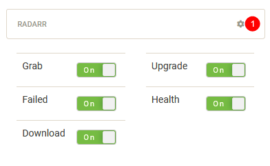
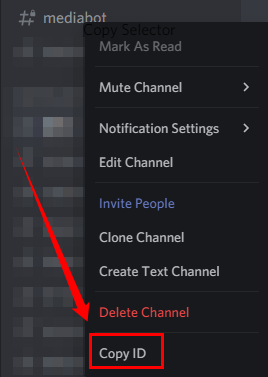
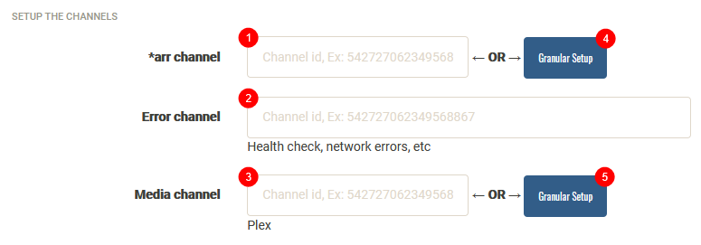
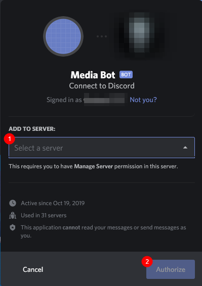
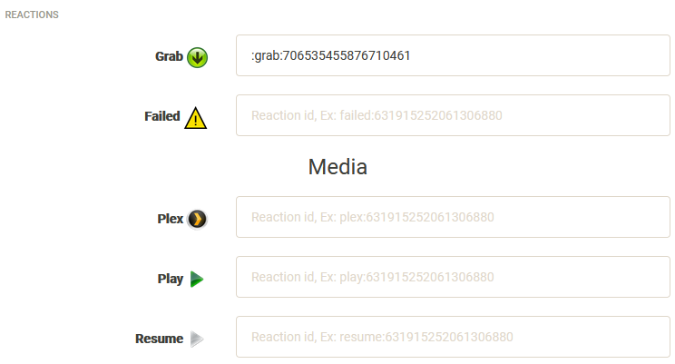
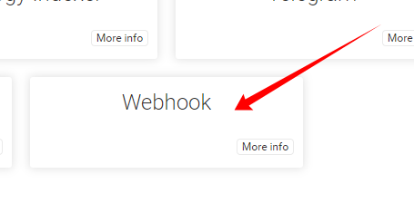
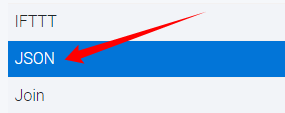
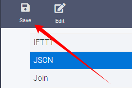

# Discord Notifier Basic Setup

Here you will see a basic setup for Discord Notifier.

------

## Login

First we're going to visit the [Discord Notifier](https://discordnotifier.com/index.php){:target="_blank"} site, if you don't have a account yet signup

 

1. Your Email address you used during signup.
1. Your Password you created during signup.
1. Login to the settings and setup.
1. Password reset if you forgot your password.
1. Signup if you don't have a account.
1. Link to Discord Notifier Discord support channel.

------

## Profile

After you logged in you will be redirected to your profile screen where you need to do a few things.

 

1. Select your Country.
1. Select your Timezone.
1. Click on `Generate API Key` (This needs to be done).
1. Change your Time Format to your liking.
1. Don't forget to Save your Changes.

------

## Notification Setup

Here you will be able to setup the following things:

- Notifications Settings => Setup which notifications you want to receive from the *arr.
- Discord Settings => Setup your discord channels and your reactions and invite the bot in to your channel.

### Notification Settings

Setup which notifications you want to to receive from the *arr.

 

Click on the cog(settings) icon to configure what will be in your notification.

### Discord Settings

Setup your discord channels and your reactions and invite the bot in to your channel.

#### Setup the channels

First thing to do is create a few channels where you receive your notifications.

!!! note
    I won't be explaining how to setup a discord channel/server/permissions that's up to you and your responsibility !!!

you can do it all from one channel or separate the notifications if you want, in this example I will do a basic setup of 3 channels.

`#mediabot` => *arr channel - All the `*arr` notifications you setup in [Notification Settings](#notification-settings).

`#error-channel` => Error channel- Health check, network errors, etc.

`#plex` => Media channel - Play state and info of Plex.

After you created the needed channels it's time to add them to the `Setup the channels`

First we need to get the channel ID's from your server/channel

Open your User Settings -> Appearance -> Enable Developer Mode.

 

 Right click on the Discord text channel you want the bot to interact  with and press "Copy ID"

 

Paste the channel ID in the corresponding boxes.

 

1. Add the Channel ID for the `#mediabot` channel.
1. Add the Channel ID for the `#error-channel` channel.
1. Add the Channel ID for the `#plex` channel.
1. Use this option if you want to use separate Channels for the notifications.
1. Use this option if you want to use separate Channels for the notifications.

### Invite the bot

It's time to invite the bot in to your Server/Channels by clicking on the following link.

 

You will get a screen that looks like the following screenshot.

 

1. Select the server the bot should join.
1. Click on `Authorize` to approve.

!!! note
     You have to be an administrator of the Discord channel to invite bots. Make sure the bot has permissions to post.

??? summary "Bot Setup Help"
    Right click on your server > Server Settings > Roles

    If you have a Bot role you can skip this, otherwise click the + next to ROLES

    Name the role Bot and scroll down to Text Permissions.

    Enable `Send Messages`, `Embed Links` & `Add Reactions`

    Go back to your server, right click on the Media Bot and assign the role of Bot

#### Reactions

Here we will setup the Discord Notifier reactions(emoji's) that will be shown during a playback in plex, or during a download/import in Sonarr/Radarr.

 

This section exist of 2 parts.

1. *arr state (grab/failed) and play state of plex.
1. The Trackers/Indexers.

First we're going to download the emoji's and you can do that in 2 ways.

1. One by One - Right click -> save as for these emoji images.
1. Pack Download - Click [here](https://discordnotifier.com/setup.php?grab=reactions){:target="_blank"} to download a zip of all the current reaction images.

For this Example we will be using the Pack Download, that you need to unpack to your computer and then add them to your Discord Server

How to add your own Emoji's => [LINK](https://support.discord.com/hc/en-us/articles/360036479811-Custom-Emojis){:target="_blank"}

After you've added them to your Discord Server it's time to get the ID's from your emoji's, to do this go in to one of your channels and type:

```bash
\:emoji_name:
```

??? example "Example"
    

    What results in to.

    

    So your ID would be `:grab:706535455876710461`.

Paste the ID results from your channel in to the corresponding boxes.

 

Do this for all the other boxes also including your Trackers/Indexers.

#### Trackers and Indexers

 

1. Paste here the the emoji ID.
1. The actual indexer name you're using in Sonarr/Radarr.

??? example "Example"

    

    What will result in to.

    

    If you use a different name in Sonarr and Radarr just add them with a comma `BeyondHD - Jackett,BHD`.

Don't forget to click on `Save Changes` !!!

!!! note
    After pasting the Emoji's ID in to the box you will notice that the leading colon will disappear nothing to worry about that's per design

------

## Integrations

This is where we add all this to your *arr and Plex.

 

### Radarr, Readarr and Lidarr

Radarr, Readarr and Lidarr supports Discord Notifier native so that's a easy one to add.

`Settings` => `Connect` => click on  and select `Discord Notifier` add your API key and you're done.

??? example "Radarr Example"
    In Radarr go to `Settings` => `Connect` => Click on  and select `DiscordNotifier.com`.

    

    Then add the following info.

    

    1. The name you want to use for the notification.
    2. Enable `On Grab`, `On Import`, `On Upgrade`, `On Health Issue` & `Include Health Warnings`.
    3. Add here you API key from Discord Notifier.
    4. Click on `Test` to see if it works.
    5. If everything is correct click on `Save`

### Sonarr

Sonarr doesn't have native support & will not get one per their devs.
that's why we're going to use the webhook method.

 

`Settings` => `Connect` > Click on  and select `Webhook`.

Add the following info.

**Name**: Discord Notifier

**Enable:** `On Grab`, `On Import`, `On Upgrade`, `On Health Issue` & `Include Health Warnings`.

**URL:** The URL that you can copy/paste from the integrations page.

Click **Save**

??? example "Sonarr Example"

    `Settings` => `Connect` > Click on  and select `Webhook`.

    

    Add the following info.

    

    1. The name you want to use for the notification.
    2. Enable `On Grab`, `On Import`, `On Upgrade`, `On Health Issue` & `Include Health Warnings`.
    3. Add the URL that you can copy/paste from the integrations page.
    4. Make sure this is on `POST`.
    5. Click on `Test` to see if it works.
    6. If everything is correct click on `Save`

### Bazarr

For Bazarr you need to make use of JSON method.

 

`Settings` => `Notifications` => and select`JSON`

On the top click on  `Edit` icon and Enable the notification type.

Add the JSON URL that you can copy/paste from the integrations page.

Scroll up and save

??? example "Bazarr Example"

    `Settings` => `Notifications` => and select`JSON`

    

    On the top click on  `Edit` icon and Enable the notification type.

    Add the following info.

    

    1. Enable the JSON Notification.
    2. Add the JSON URL that you can copy/paste from the integrations page.
    3. Click on `Test` to see if it works.
    4. If everything is correct click on `Ok`

    Don't forget to click on Save on the top of the Bazarr screen.

    

### Plex

For Plex we're going to use the Webhook method.

 

`Settings` => `Webhooks` => click on `ADD WEBHOOK` and add the URL that you can copy/paste from the integrations page and click on `SAVE CHANGES`

??? example "Plex Example"

    `Settings` => `Webhooks` => click on `ADD WEBHOOK`

    On the top right click on the  `Settings` icon, and on the left sidebar select `Webhooks`
    Click on the middle of the screen on  and add the following info.

    

    1. Add the URL that you can copy/paste from the integrations page.
    2. Click on `SAVE CHANGES`

### Testing

On the top of the integrations page you will have now the ability to test your settings.

 

Click on the icons to test your notifications.
