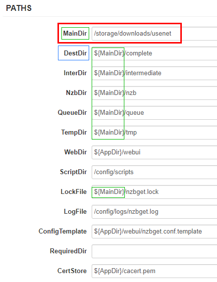
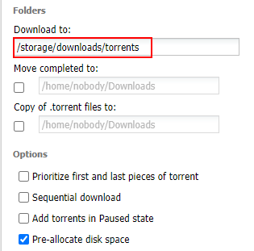

# How To Set Up Hardlinks and Atomic-Moves

## Description

!!! info

    If you’re wondering why hard links aren’t working or why a simple move is taking far longer than it should.

    Here we will try to explains it.

    The paths you use on the inside matter. Because of how Docker’s volumes work, passing in two or three volumes such as the commonly suggested `/tv`, `/movies` and `/downloads` makes them look like two or three file systems, even if they aren’t. This means hard links won’t work and instead of an instant move, a slower and more I/O intensive copy + delete is used.

So you want one of the following ?

- Instant moves (Atomic-Moves) during import of the *arr (useful when using Usenet)?
- You don't want to use twice the storage when using torrents. (hardlinks)?
- You want to perma seed?

Then keep reading.

### FAQ

??? faq "FAQ"

    1. Q: **What are the `*arr`?**

        - Sonarr, Radarr, Lidarr, etc.

    1. Q: **What are hardlinks?**

        - Short answer is "having a file in multiple folders" without using up your storage, [Long Answer](https://medium.com/@krisbredemeier/the-difference-between-hard-links-and-soft-or-symbolic-links-780149244f7d){:target="_blank"}.

    1. Q: **What's Atomic Moves?**

        - A real move and not a copy file from download folder to media folder and then delete file from download folder.

------

### How to Setup for

- [DockSTARTer](#dockstarter)
- [UnRaid](#unraid) (soon)

#### DockSTARTer

??? summary "DockSTARTer"

    !!! note

        I'm using the default paths in this example, and will keep the other paths unchanged so nothing will break if you make a mistake.

    We're going to use a mounted drive that we're going to use as storage for downloads and your media.
    In this example the mounted drive will be mounted to `/mnt/` with the following folder structure.

    ```
    storage
    ├── downloads
    |  ├── torrents
    │  |   ├── movies
    │  |   ├── music
    │  |   └── tv
    |  └── usenet
    │     ├── movies
    │     ├── music
    │     └── tv
    └── medialibrary
       ├── movies
       ├── music
       └── tv
    ```

    ##### Step 1
    To accomplisch this we need to change first a few paths in your `.env` (Usually `~/.docker/compose/.env`)

    ```yaml
    # Global Settings
    COMPOSE_HTTP_TIMEOUT=60
    DOCKERCONFDIR=~/.config/appdata
    DOCKERGID=999
    DOCKERHOSTNAME=DockSTARTer
    DOCKERLOGGING_MAXFILE=10
    DOCKERLOGGING_MAXSIZE=200k
    DOCKERSTORAGEDIR=/mnt/storage
    PGID=1000
    PUID=1000
    TZ=America/Chicago

    # DEPRECATED Settings (will be removed at the end of 2020)
    DOCKERSHAREDDIR=~/shared
    DOWNLOADSDIR=/mnt/downloads
    MEDIADIR_AUDIOBOOKS=/mnt/medialibrary/audiobooks
    MEDIADIR_BOOKS=/mnt/medialibrary/books
    MEDIADIR_COMICS=/mnt/medialibrary/comics
    MEDIADIR_MOVIES=/mnt/medialibrary/movies
    MEDIADIR_MUSIC=/mnt/medialibrary/music
    MEDIADIR_TV=/mnt/medialibrary/tv
    ```

    ##### Step 2

    When that's all set then you will need to change the paths you're going to use in the containers from:

    `/downloads` => `/storage/downloads`

    `/audiobooks` => `/storage/medialibrary/audiobooks`

    `/books` => `/storage/medialibrary/books`

    `/comics`  => `/storage/medialibrary/comics`

    `/movies` => `/storage/medialibrary/movies`

    `/music` => `/storage/medialibrary/music`

    `/tv` => `/storage/medialibrary/tv`

#### UnRaid

??? summary "UnRaid"

    Soon

------

### Examples

!!! info

    Pick one path layout and use it for all of them.

    It doesn't matter if you prefer to use `/data`, `/shared`, `/storage` or whatever.

    The screenshots in the examples are using the following root path `/storage`

- [Sonarr](#sonarr)
- [Radarr](#radarr)
- [SABnzbd](#sabnzbd)
- [NZBGet](#nzbget)
- [qBittorrent](#qbittorent)
- [Deluge](#deluge)
- [ruTorrent](#rutorrent)

#### Sonarr

??? example "Sonarr Examples"

    `Settings` => `Media Managemen` => `Root Folders`

    

    `Series` => `Add New`

    

    

#### Radarr

??? example "Radarr Examples"

    `Settings` => `Media Managemen` => `Root Folders`

    

    `Movies` => `Add New`

    

    

#### SABnzbd config

??? example "SABnzbd Examples"

    `SABnzbd config` => `Folders`

    

    `SABnzbd config` => `Categories`

    

#### NZBGet

??? example "NZBGet Examples"

    `Settings` => `PATHS`

    

    `Settings` => `CATEGORIES`

    

#### qBittorrent

??? example "qBittorrent Examples"

    `Options` => `Downloads`

    

#### Deluge

??? example "Deluge Example"

    `Preferences` => `Downloads`

    

#### ruTorrent

??? example "ruTorrent Examples"

    `../config/rtorrent/config/rtorrent.rc` (path to your appdata)

    

    `Settings` => `Downloads`

    

    `Settings` => `Autotools`

    

------

Big Thnx to [fryfrog](https://github.com/fryfrog){:target="_blank"} for his [Docker Guide](https://wiki.servarr.com/Docker_Guide){:target="_blank"} that I used as basis for this guide.
