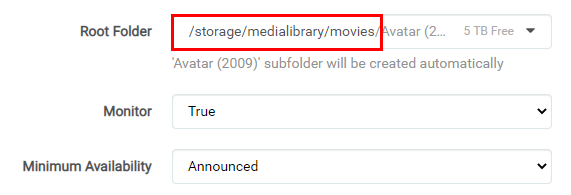
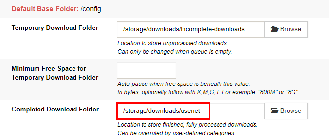
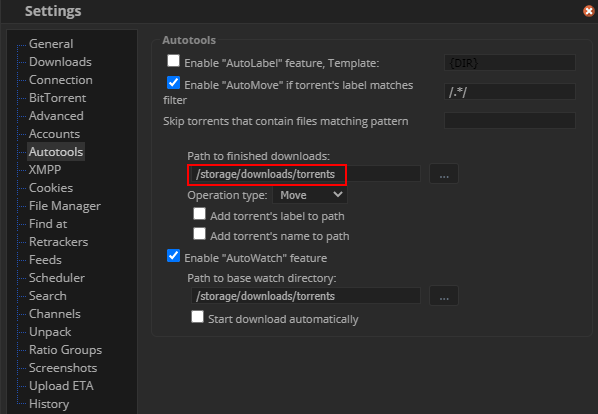
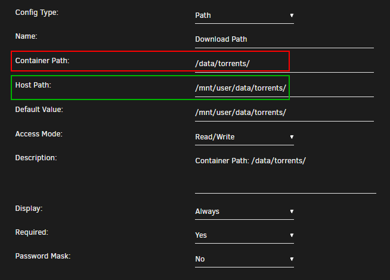
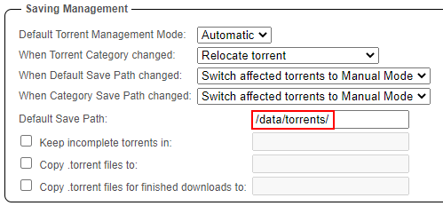
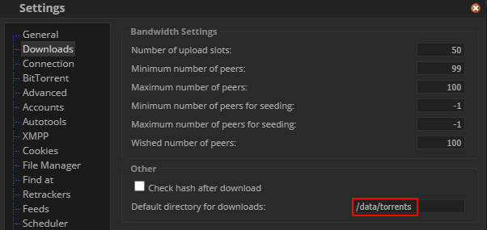
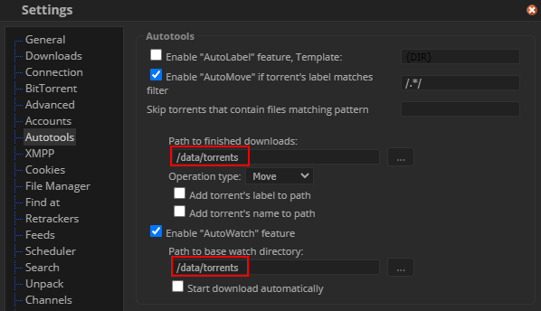

# How To Set Up Hardlinks and Atomic-Moves

## Description

!!! info

    If you’re wondering why hard links aren’t working or why a simple move is taking far longer than it should.

    Here we will try to explains it.

    The paths you use on the inside matter. Because of how Docker’s volumes work, passing in two or three volumes such as the commonly suggested `/tv`, `/movies` and `/downloads` makes them look like two or three file systems, even if they aren’t. This means hard links won’t work and instead of an instant move, a slower and more I/O intensive copy + delete is used.

So you want one of the following ?

- Instant moves (Atomic-Moves) during import of the *arr (useful when using Usenet)?
- You don't want to use twice the storage when using torrents. (hardlinks)?
- You want to perma seed?

Then keep reading.

??? faq "FAQ"

    ### FAQ

    1. Q: **What are the `*arr`?**

        - Sonarr, Radarr, Lidarr, etc.

    1. Q: **What are hardlinks?**

        - Short answer is "having a file in multiple folders" without using up your storage, [Long Answer](https://medium.com/@krisbredemeier/the-difference-between-hard-links-and-soft-or-symbolic-links-780149244f7d){:target="_blank" rel="noopener noreferrer"}.

    1. Q: **What's Atomic Moves?**

        - A real move and not a copy file from download folder to media folder and then delete file from download folder.

------

### How to Setup for

- [DockSTARTer](#dockstarter)
- [UnRaid](#unraid)
- [Synology](#synology)
- [Docker](#docker)
- [Bare Metal (Native)](#native)

??? summary "DockSTARTer"

    #### DockSTARTer

    !!! note

        I'm using the default paths in this example, and will keep the other paths unchanged so nothing will break if you make a mistake.

    ##### Folder Structure

    We're going to use a mounted drive that we're going to use as storage for downloads and your media.
    In this example the mounted drive will be mounted to `/mnt/` with the following folder structure.

    ```
    storage
    ├── downloads
    |  ├── torrents
    │  |  ├── movies
    │  |  ├── music
    │  |  └── tv
    |  └── usenet
    │     ├── movies
    │     ├── music
    │     └── tv
    └── medialibrary
       ├── movies
       ├── music
       └── tv
    ```

    ##### Changes to the .env
    To accomplish this we need to change first a few paths in your `.env` (Usually `~/.docker/compose/.env`)

    ``` yaml
    # Global Settings
    COMPOSE_HTTP_TIMEOUT=60
    DOCKERCONFDIR=~/.config/appdata
    DOCKERGID=999
    DOCKERHOSTNAME=DockSTARTer
    DOCKERLOGGING_MAXFILE=10
    DOCKERLOGGING_MAXSIZE=200k
    DOCKERSTORAGEDIR=/mnt/storage
    PGID=1000
    PUID=1000
    TZ=America/Chicago

    # DEPRECATED Settings (will be removed at the end of 2020)
    DOCKERSHAREDDIR=~/shared
    DOWNLOADSDIR=/mnt/downloads
    MEDIADIR_AUDIOBOOKS=/mnt/medialibrary/audiobooks
    MEDIADIR_BOOKS=/mnt/medialibrary/books
    MEDIADIR_COMICS=/mnt/medialibrary/comics
    MEDIADIR_MOVIES=/mnt/medialibrary/movies
    MEDIADIR_MUSIC=/mnt/medialibrary/music
    MEDIADIR_TV=/mnt/medialibrary/tv
    ```

    ##### Changes to your paths

    When that's all set then you will need to change the paths you're going to use in the containers from:

    `/downloads` => `/storage/downloads`

    `/audiobooks` => `/storage/medialibrary/audiobooks`

    `/books` => `/storage/medialibrary/books`

    `/comics`  => `/storage/medialibrary/comics`

    `/movies` => `/storage/medialibrary/movies`

    `/music` => `/storage/medialibrary/music`

    `/tv` => `/storage/medialibrary/tv`

    ##### DockSTARTer Examples

    !!! info

        The screenshots in the examples are using the following root path `/storage`


    ??? example "Sonarr Examples"

        ###### Sonarr

        `Settings` => `Media Management` => `Importing`

        

        `Settings` => `Media Management` => `Root Folders`

        

        `Series` => `Add New`

        

        

    ??? example "Radarr Examples"

        ###### Radarr

        `Settings` => `Media Management` => `Importing`

        

        `Settings` => `Media Management` => `Root Folders`

        

        `Movies` => `Add New`

        

        

    ??? example "SABnzbd Examples"

        ###### SABnzbd

        `SABnzbd config` => `Folders`

        

        `SABnzbd config` => `Categories`

        

    ??? example "NZBGet Examples"

        ###### NZBGet

        `Settings` => `PATHS`

        

        `Settings` => `CATEGORIES`

        

    ??? example "qBittorrent Examples"

        ###### qBittorrent

        `Options` => `Downloads`

        

    ??? example "Deluge Example"

        ###### Deluge

        `Preferences` => `Downloads`

        

    ??? example "ruTorrent Examples"

        ###### ruTorrent

        `../config/rtorrent/config/rtorrent.rc` (path to your appdata)

        

        `Settings` => `Downloads`

        

        `Settings` => `Autotools`

        

??? summary "UnRaid"

    #### UnRaid

    !!! note

        The first thing you need to do is forget the suggested paths from the Spaceinvader One YouTube Tutorials,

        and don't use the predefined paths from the unraid templates.

        (Spaceinvader One YouTube guides are great to learn how to start with unraid or how to setup certain applications, and yes I did and still do use them. Probably the main reason why he's using those path is because they are predefined in the template)

    ------

    ##### Create the main share

    !!! attention

        To get Hardlinks and Atomic-Moves working with Unraid you will need to make use of **ONE** share with subfolders.

    For this example I'm using my own setup and preferred share `data`.

    Go to your dashboard and on the top select `shares` select `add share` .

    

    1. use `data`
    1. if you got a cache drive and want to make use of it put it on `Yes` or keep it disabled (Hardlinks will stay in tact if you're using the cache)
    1. click on `ADD SHARE`

    !!! note

        Keep in mind regarding the use of the Cache drive, The mover can't move files that are in use, like  when seeding with torrents. You will need to shutdown your client or stop/pause the torrents so the mover can move them to your Array.

        With Usenet  you won't have any issues.

    ------

    ##### Folder Structure

    On the host (Unraid) you will need to add `/mnt/user` before it. **So `/mnt/user/data`**

    The `data` folder has sub-folders for `torrents` and `usenet` and each of these have sub-folders for `tv`, `movie` and `music` downloads to keep things neat. The `media` folder has nicely named `TV`, `Movies` and `Music` sub-folders, this is your library and what you’d pass to Plex, Emby or JellyFin.

    These subfolders you need to create your self, you can use krusader or winscp to create them or any other way you prefer.

    ```none
    data
    ├── torrents
    │  ├── movies
    │  ├── music
    │  └── tv
    ├── usenet
    │  ├── movies
    │  ├── music
    │  └── tv
    └── media
       ├── movies
       ├── music
       └── tv
    ```

    *I'm using lower case on all folder on  purpose, being Linux is case sensitive.*

    ------

    ##### Setting up the containers

    After you created all the needed folders it's time to setup the paths in the docker containers.

    Go to your dashboard and select your docker container you want to edit or if you're starting fresh add the docker containers you want to use or prefer.

    Unraid makes it actually  pretty clear what's the Host Path and what's the Container Path.

    `Container Path:` => The path that will be used inside the container.

    `Host Path:` => The path on your Unraid Server (The Host).

    ------

    ##### Torrent clients

    qBittorrent, Deluge, ruTorrent

    

    `Container Path:` => `/data/torrents/`

    `Host Path:` => `/mnt/user/data/torrents/`

    !!! info

        The reason why we use `/data/torrents/` for the torrent client is because it only needs access to the torrent files. In the torrent software settings, you’ll need to reconfigure paths and you can sort into sub-folders like `/data/torrents/{tv|movies|music}`.

    ```none
    data
    └── torrents
       ├── movies
       ├── music
       └── tv
    ```

    ------

    ##### Usenet clients

    NZBGet or SABnzbd

    

    `Container Path:` => `/data/usenet/`

    `Host Path:` => `/mnt/user/data/usenet/`

    !!! info

        The reason why we use `/data/usenet/` for the usenet client is because it only needs access to the usenet files. In the usenet software settings, you’ll need to reconfigure paths and you can sort into sub-folders like `/data/usenet/{tv|movies|music}`.

    ```none
    data
    └── usenet
       ├── movies
       ├── music
       └── tv
    ```

    ------

    ##### The arr(s)

    Sonarr, Radarr and Lidarr

    

    `Container Path:` => `/data`

    `Host Path:` => `/mnt/user/data/`

    !!! info

        Sonarr, Radarr and Lidarr gets access to everything because the download folder(s) and media folder will look like and be one file system. Hard links will work and moves will be atomic, instead of copy + delete.

    ```none
    data
    ├── torrents
    │  ├── movies
    │  ├── music
    │  └── tv
    ├── usenet
    │  ├── movies
    │  ├── music
    │  └── tv
    └── media
       ├── movies
       ├── music
       └── tv
    ```

    ------

    ##### Media Server

    Plex, Emby, JellyFin and Bazarr

    

    `Container Path:` => `/data/media`

    `Host Path:` => `/mnt/user/data/media/`

    !!! info

        Plex, Emby, JellyFin and Bazarr only needs access to your media library, which can have any number of sub folders like Movies, Kids Movies, TV, Documentary TV and/or Music as sub folders.

    ```none
    data
    └── media
       ├── movies
       ├── music
       └── tv
    ```

    ------

    ##### Final Result

    

    **Don't forget to look at the [Examples](#examples) how to setup the paths inside the containers.**

??? summary "Synology"

    #### Synology

    !!! note

        Being I don't have a Synology myself and I kind of hate the Synology GUI for the dockers, I'm doing this with the use of docker-compose.

        This works like 10x faster then the GUI and after adding it shows up in the GUI.

        Thnx to faxity for the initial compose that I used to create the Synology Guide.

    We need to get some information that we need later to setup the docker-compose file.

    ##### PUID and PGID

    In order for the Docker container to access the shares on the Synology,
    we need to give it the same permissions as your main user who has access to those shares.
    For this we need to figure out the PUID and the PGID of the user having access to your shares.

    You will need to SSH into your Synology.
    If you didn't already enable it you need to do that first

    

    Then use a program like Putty and SSH to your Synology.

    Login if you get a popup asking if you want to trust the key,
    Just press `OK` or `ACCEPT`

    Enter the login information of your main Synology user account.

    

    Once logged in type `id`.
    This will show your UID (aka PUID).
    Which in this screenshot is `1026` for the administrator
    and the GID (aka PGID) which is `100` for the users group.
    Remember these values for later use.

    !!! note

        Yes we know it's not recommended to use the admin account but if you already know this then you wouldn't need to read this ;)

    ------

    ##### Folder Structure

    !!! attention

        To get Hardlinks and Atomic-Moves working with your Synology you will need to make use of **ONE** share with subfolders.

    For this example we're going to make use of a share called `data`.

    On the host (Synology) you will need to add `/volume1/` before it. So `/volume1/data`

    The `data` folder has sub-folders for `torrents` and `usenet` and each of these have sub-folders for `tv`, `movie` and `music` downloads to keep things neat. The `media` folder has nicely named `TV`, `Movies` and `Music` sub-folders, this is your library and what you’d pass to Plex, Emby or JellyFin.

    These subfolders you need to create your self.

    *I'm using lower case on all folder on  purpose, being Linux is case sensitive.*

    ```none
    data
    ├── torrents
    │  ├── movies
    │  ├── music
    │  └── tv
    ├── usenet
    │  ├── movies
    │  ├── music
    │  └── tv
    └── media
       ├── movies
       ├── music
       └── tv
    ```

    ??? summary "Breakdown of the Folder Structure"

        ##### Breakdown of the Folder Structure

        ###### Torrent clients

        qBittorrent, Deluge, ruTorrent

        The reason why we use `/data/torrents` for the torrent client is because it only needs access to the torrent files. In the torrent software settings, you’ll need to reconfigure paths and you can sort into sub-folders like `/data/torrents/{tv|movies|music}`.

        ```none
        data
        └── torrents
           ├── movies
           ├── music
           └── tv
        ```

        ###### Usenet clients

        NZBGet or SABnzbd

        The reason why we use `/data/usenet` for the usenet client is because it only needs access to the usenet files. In the usenet software settings, you’ll need to reconfigure paths and you can sort into sub-folders like `/data/usenet/{tv|movies|music}`.

        ```none
        data
        └── usenet
           ├── movies
           ├── music
           └── tv
        ```

        ###### The arr(s)

        Sonarr, Radarr and Lidarr

        Sonarr, Radarr and Lidarr gets access to everything because the download folder(s) and media folder will look like and be one file system. Hard links will work and moves will be atomic, instead of copy + delete.

        ```none
        data
        ├── torrents
        │  ├── movies
        │  ├── music
        │  └── tv
        ├── usenet
        │  ├── movies
        │  ├── music
        │  └── tv
        └── media
           ├── movies
           ├── music
           └── tv
        ```

        ###### Media Server

        Plex, Emby, JellyFin and Bazarr

        Plex, Emby, JellyFin and Bazarr only needs access to your media library, which can have any number of sub folders like Movies, Kids Movies, TV, Documentary TV and/or Music as sub folders.

        ```none
        data
        └── media
           ├── movies
           ├── music
           └── tv
        ```

    ------

    ##### Appdata

    Your appdata will be stored in `/volume1/docker/appdata/{appname}`
    These `{appname}` sub folders you need to create your self. (*This is a limitation of the Synology*)
    We're going to do this in Putty or a similar program.

    ```bash
    sudo mkdir /volume1/docker/appdata
    cd /volume1/docker/appdata
    sudo mkdir radarr sonarr bazarr plex tautulli
    ```

    So your appdata folder will look like this.

    ```bash
    ls -al /volume1/docker/appdata
    ```

    ```none
    docker
    └── appdata
       ├── radarr
       ├── sonarr
       ├── bazarr
       ├── plex
       └── tautulli
    ```

    ------

    ##### Needed files

    First we will download the `docker-compose.yml` file

    Download this [docker-compose.yml](https://github.com/TRaSH-/Guides-Synology-Templates/blob/main/docker-compose/docker-compose.yml){:target="_blank" rel="noopener noreferrer"} to your `/volume1/docker/appdata` location so you got your important stuff together.

    ```bash
    sudo wget https://raw.githubusercontent.com/TRaSH-/Guides-Synology-Templates/main/docker-compose/docker-compose.yml
    ```

    ??? question "What's included and What's not included"

        This docker-compose file will have the following docker containers included.

        - Radarr
        - Sonarr
        - Bazarr (Subtitle searcher and downloaded)
        - Plex
        - Tautulli
        - Watchtower (automatic docker container updater at 4am)

        What's not included.

        I didn't add a downloader to it because it depends on what you prefer usenet/torrents and which client you prefer, so i created a new [Repository](https://github.com/TRaSH-/Guides-Synology-Templates){:target="_blank" rel="noopener noreferrer"} on Github where I provide and maintain some templates that you can find in the `template` folder ready to use with the main `docker-compose.yml`.

        The only thing you need to do is copy/paste what's inside the `.yml` file in to the main `docker-compose.yml`, the template also has the command what you need to use to create the [appdata](#appdata) folder that we explained earlier.

    Second we will download the `.env` file

    Download this [.env](https://github.com/TRaSH-/Guides-Synology-Templates/blob/main/docker-compose/.env){:target="_blank" rel="noopener noreferrer"} to your `/volume1/docker/appdata` location so you got your important stuff together.

    ```bash
    sudo wget https://raw.githubusercontent.com/TRaSH-/Guides-Synology-Templates/main/docker-compose/.env
    ```

    ------

    ##### Changes you need to do

    The `.env` we downloaded holds the variables/information you need to change so everything works (I added also a description in the `.env` file)

    1. DOCKERCONFDIR (only change this if you know what you're doing and decide to use another path then in this guide used)
    1. DOCKERDATADIR (only change this if you know what you're doing and decide to use another path then in this guide used)
    1. PUID/PGID (this info you got earlier from [HERE](#puid-and-pgid))
    1. TZ (Change to your timezone)

    It holds more variables/information for other containers but they are described in the `.env`

    ------

    ##### Permissions

    Now we need to make sure that the newly created files and folders have the correct permissions.

    !!! note
        If you're using another user then `admin` then you need to change it in the commands below !!!

    ```bash
    sudo chown -R admin:users /volume1/data /volume1/docker
    sudo chmod -R a=,a+rX,u+w,g+w /volume1/data /volume1/docker
    ```

    ------

    ##### Run the Docker Compose

    !!! important
        make sure you deleted/removed all your existing dockers from the GUI and also remove your native installs of these applications !!!

    When you did all the above steps you only need to type the following in your `/volume1/docker/appdata`

    ```bash
    cd /volume1/docker/appdata
    sudo docker-compose up -d
    ```

    You will notice that all the images will be downloaded, and after that the containers will be started. If you get a error then look at the error what it says and try to fix it. If you still got issues then put your used docker-compose.yml on pastebin and join the guides-discord [here](https://trash-guides.info/discord){:target="_blank" rel="noopener noreferrer"} and provide the pastebin link with the error, have patience because of timezone differences.

    ------

    **Don't forget to look at the [Examples](#examples) how to setup the paths inside the containers.**

    !!! attention

        If you need to do any changes only edit the `docker-compose.yml` file and activate the changes when you type `sudo docker-compose up -d` again.

        Any changes you do/did in the GUI will be reverted when you run the docker-compose.

        Just don't use the GUI !!!

    ??? hint "docker-compose commands"

        - `sudo docker-compose up -d` (This Docker-compose command helps builds the image, then creates and starts Docker containers. The containers are from the services specified in the compose file. If the containers are already running and you run docker-compose up, it recreates the container.)
        - `sudo docker-compose pull` (Pulls an image associated with a service defined in a docker-compose.yml)
        - `sudo docker-compose down` (The Docker-compose down command also stops Docker containers like the stop command does. But it goes the extra mile. Docker-compose down, doesn’t just stop the containers, it also removes them.)
        - `sudo docker system prune -a --volumes --force` (Remove all unused containers, networks, images (both dangling and unreferenced), and optionally, volumes.)

??? summary "Docker"

    #### Docker

    !!! tip

        If you're new to dockers and want a easy setup I suggest to take a look at [DockSTARTer](https://dockstarter.com/){:target="_blank" rel="noopener noreferrer"}.
        I've also created a short guide [HERE](#dockstarter) where I explain the settings for the most used applications.

        The main goal of DockSTARTer is to make it quick and easy to get up and running with Docker.
        You may choose to rely on DockSTARTer for various changes to your Docker system or use DockSTARTer as a stepping stone and learn to do more advanced configurations.

        *DockSTARTer was actually my first steps in to the world of dockers.*

    !!! note

        I'm not going to explain how to get dockers installed and running, I will only explain which folder structure we recommend.

    ##### Folder Structure

    !!! attention

        It doesn't really matter which path you use for your media and appdata,

        the only thing you should avoid is `/home`.

        Because user folders in `/home` are expected to have some restrictive permissions.

        It just could end up creating a permissions mess, so it's better to just avoid entirely.

    For this example we're going to make use of a share called `data`.

    The `data` folder has sub-folders for `torrents` and `usenet` and each of these have sub-folders for `tv`, `movie` and `music` downloads to keep things neat. The `media` folder has nicely named `TV`, `Movies` and `Music` sub-folders, this is your library and what you’d pass to Plex, Emby or JellyFin.

    *In this examples I'm using lower case on all folder on purpose, being Linux is case sensitive.*

    ```none
    data
    ├── torrents
    │  ├── movies
    │  ├── music
    │  └── tv
    ├── usenet
    │  ├── movies
    │  ├── music
    │  └── tv
    └── media
       ├── movies
       ├── music
       └── tv
    ```

    ??? summary "Breakdown of the Folder Structure"

        ##### Breakdown of the Folder Structure

        ###### Torrent clients

        qBittorrent, Deluge, ruTorrent

        The reason why we use `/data/torrents` for the torrent client is because it only needs access to the torrent files. In the torrent software settings, you’ll need to reconfigure paths and you can sort into sub-folders like `/data/torrents/{tv|movies|music}`.

        ```none
        data
        └── torrents
           ├── movies
           ├── music
           └── tv
        ```

        ###### Usenet clients

        NZBGet or SABnzbd

        The reason why we use `/data/usenet` for the usenet client is because it only needs access to the usenet files. In the usenet software settings, you’ll need to reconfigure paths and you can sort into sub-folders like `/data/usenet/{tv|movies|music}`.

        ```none
        data
        └── usenet
           ├── movies
           ├── music
           └── tv
        ```

        ###### The arr(s)

        Sonarr, Radarr and Lidarr

        Sonarr, Radarr and Lidarr gets access to everything because the download folder(s) and media folder will look like and be one file system. Hard links will work and moves will be atomic, instead of copy + delete.

        ```none
        data
        ├── torrents
        │  ├── movies
        │  ├── music
        │  └── tv
        ├── usenet
        │  ├── movies
        │  ├── music
        │  └── tv
        └── media
           ├── movies
           ├── music
           └── tv
        ```

        ###### Media Server

        Plex, Emby, JellyFin and Bazarr

        Plex, Emby, JellyFin and Bazarr only needs access to your media library, which can have any number of sub folders like Movies, Kids Movies, TV, Documentary TV and/or Music as sub folders.

        ```none
        data
        └── media
           ├── movies
           ├── music
           └── tv
        ```

    **Don't forget to look at the [Examples](#examples) how to setup the paths inside the containers.**

??? summary "Bare Metal (Native)"

    #### Native

    !!! note

        I'm not going to explain how to install all the applications, I will only explain which folder structure we recommend.

    ------

    ##### Folder Structure


    !!! attention

        It doesn't really matter which path you use for your media,

        the only thing you should  avoid is `/home`.

        Because user folders in `/home` are expected to have some restrictive permissions.

        It just could end up creating a permissions mess, so it's better to just avoid entirely.

    For this example we're going to make use of a share called `data`.

    The `data` folder has sub-folders for `torrents` and `usenet` and each of these have sub-folders for `tv`, `movie` and `music` downloads to keep things neat. The `media` folder has nicely named `TV`, `Movies` and `Music` sub-folders, this is your library and what you’d pass to Plex, Emby or JellyFin.

    *I'm using lower case on all folder on purpose, being Linux is case sensitive.*

    ```none
    data
    ├── torrents
    │  ├── movies
    │  ├── music
    │  └── tv
    ├── usenet
    │  ├── movies
    │  ├── music
    │  └── tv
    └── media
       ├── movies
       ├── music
       └── tv
    ```

    ??? summary "Breakdown of the Folder Structure"

        ##### Breakdown of the Folder Structure

        ###### Torrent clients

        qBittorrent, Deluge, ruTorrent

        The reason why we use `/data/torrents` for the torrent client is because it only needs access to the torrent files. In the torrent software settings, you’ll need to reconfigure paths and you can sort into sub-folders like `/data/torrents/{tv|movies|music}`.

        ```none
        data
        └── torrents
           ├── movies
           ├── music
           └── tv
        ```

        ###### Usenet clients

        NZBGet or SABnzbd

        The reason why we use `/data/usenet` for the usenet client is because it only needs access to the usenet files. In the usenet software settings, you’ll need to reconfigure paths and you can sort into sub-folders like `/data/usenet/{tv|movies|music}`.

        ```none
        data
        └── usenet
           ├── movies
           ├── music
           └── tv
        ```

        ###### The arr(s)

        Sonarr, Radarr and Lidarr

        Sonarr, Radarr and Lidarr gets access to everything because the download folder(s) and media folder will look like and be one file system. Hard links will work and moves will be atomic, instead of copy + delete.

        ```none
        data
        ├── torrents
        │  ├── movies
        │  ├── music
        │  └── tv
        ├── usenet
        │  ├── movies
        │  ├── music
        │  └── tv
        └── media
           ├── movies
           ├── music
           └── tv
        ```

        ###### Media Server

        Plex, Emby, JellyFin and Bazarr

        Plex, Emby, JellyFin and Bazarr only needs access to your media library, which can have any number of sub folders like Movies, Kids Movies, TV, Documentary TV and/or Music as sub folders.

        ```none
        data
        └── media
           ├── movies
           ├── music
           └── tv
        ```

    ------

    ##### Permissions

    Recursively chown user and group and Recursively chmod to 775/664

    ```bash
    sudo chown -R $USER:$USER /data
    sudo chmod -R a=,a+rX,u+w,g+w /data
    ```

    **Don't forget to look at the [Examples](#examples) how to setup the paths inside the containers.**

------

### Examples

!!! info

    Pick one path layout and use it for all of them.

    It doesn't matter if you prefer to use `/data`, `/shared`, `/storage` or whatever.

    The screenshots in the examples are using the following root path `/data`

- [Sonarr](#sonarr)
- [Radarr](#radarr)
- [SABnzbd](#sabnzbd)
- [NZBGet](#nzbget)
- [qBittorrent](#qbittorent)
- [Deluge](#deluge)
- [ruTorrent](#rutorrent)

??? example "Sonarr Examples"

    #### Sonarr

    `Settings` => `Media Management` => `Importing`

    

    `Settings` => `Media Management` => `Root Folders`

    

    `Series` => `Add New`

    

    

??? example "Radarr Examples"

    #### Radarr

    `Settings` => `Media Management` => `Importing`

    

    `Settings` => `Media Management` => `Root Folders`

    

    `Movies` => `Add New`

    

    

??? example "SABnzbd Examples"

    #### SABnzbd

    `SABnzbd config` => `Folders`

    

    `SABnzbd config` => `Categories`

    

??? example "NZBGet Examples"

    #### NZBGet

    `Settings` => `PATHS`

    

    `Settings` => `CATEGORIES`

    

??? example "qBittorrent Examples"

    #### qBittorrent

    `Options` => `Downloads`

    

??? example "Deluge Example"

    #### Deluge

    `Preferences` => `Downloads`

    

??? example "ruTorrent Examples"

    #### ruTorrent

    `../config/rtorrent/config/rtorrent.rc` (path to your appdata)

    

    `Settings` => `Downloads`

    

    `Settings` => `Autotools`

    

------

Big Thnx to [fryfrog](https://github.com/fryfrog){:target="_blank" rel="noopener noreferrer"} for his [Docker Guide](https://wiki.servarr.com/Docker_Guide){:target="_blank" rel="noopener noreferrer"} that I used as basis for this guide.
