# How To Set Up Hardlinks and Atomic-Moves

## Description

!!! info

    If you’re wondering why hard links aren’t working or why a simple move is taking far longer than it should.

    Here we will try to explains it.

    The paths you use on the inside matter. Because of how Docker’s volumes work, passing in two or three volumes such as the commonly suggested `/tv`, `/movies` and `/downloads` makes them look like two or three file systems, even if they aren’t. This means hard links won’t work and instead of an instant move, a slower and more I/O intensive copy + delete is used.

So you want one of the following ?

- Instant moves (Atomic-Moves) during import of the *arr (useful when using Usenet)?
- You don't want to use twice the storage when using torrents. (hardlinks)?
- You want to perma seed?

Then keep reading.

??? faq "FAQ"

    ### FAQ

    1. Q: **What are the `*arr`?**

        - Sonarr, Radarr, Lidarr, etc.

    1. Q: **What are hardlinks?**

        - Short answer is "having a file in multiple folders" without using up your storage, [Long Answer](https://medium.com/@krisbredemeier/the-difference-between-hard-links-and-soft-or-symbolic-links-780149244f7d){:target="_blank"}.

    1. Q: **What's Atomic Moves?**

        - A real move and not a copy file from download folder to media folder and then delete file from download folder.

------

### How to Setup for

- [DockSTARTer](#dockstarter)
- [UnRaid](#unraid)
- [Synology](#synology)
- [Docker](#docker)

??? summary "DockSTARTer"

    #### DockSTARTer

    !!! note

        I'm using the default paths in this example, and will keep the other paths unchanged so nothing will break if you make a mistake.

    ##### Folder Structure

    We're going to use a mounted drive that we're going to use as storage for downloads and your media.
    In this example the mounted drive will be mounted to `/mnt/` with the followig folder structure.

    ```
    storage
    ├── downloads
    |  ├── torrents
    │  |  ├── movies
    │  |  ├── music
    │  |  └── tv
    |  └── usenet
    │     ├── movies
    │     ├── music
    │     └── tv
    └── medialibrary
       ├── movies
       ├── music
       └── tv
    ```

    ##### Changes to the .env
    To accomplisch this we need to change first a few paths in your `.env` (Usually `~/.docker/compose/.env`)

    ``` yaml
    # Global Settings
    COMPOSE_HTTP_TIMEOUT=60
    DOCKERCONFDIR=~/.config/appdata
    DOCKERGID=999
    DOCKERHOSTNAME=DockSTARTer
    DOCKERLOGGING_MAXFILE=10
    DOCKERLOGGING_MAXSIZE=200k
    DOCKERSTORAGEDIR=/mnt/storage
    PGID=1000
    PUID=1000
    TZ=America/Chicago

    # DEPRECATED Settings (will be removed at the end of 2020)
    DOCKERSHAREDDIR=~/shared
    DOWNLOADSDIR=/mnt/downloads
    MEDIADIR_AUDIOBOOKS=/mnt/medialibrary/audiobooks
    MEDIADIR_BOOKS=/mnt/medialibrary/books
    MEDIADIR_COMICS=/mnt/medialibrary/comics
    MEDIADIR_MOVIES=/mnt/medialibrary/movies
    MEDIADIR_MUSIC=/mnt/medialibrary/music
    MEDIADIR_TV=/mnt/medialibrary/tv
    ```

    ##### Changes to your paths

    When that's all set then you will need to change the paths you're going to use in the containers from:

    `/downloads` => `/storage/downloads`

    `/audiobooks` => `/storage/medialibrary/audiobooks`

    `/books` => `/storage/medialibrary/books`

    `/comics`  => `/storage/medialibrary/comics`

    `/movies` => `/storage/medialibrary/movies`

    `/music` => `/storage/medialibrary/music`

    `/tv` => `/storage/medialibrary/tv`

    ##### DockSTARTer Examples

    !!! info

        The screenshots in the examples are using the following root path `/storage`


    ??? example "Sonarr Examples"

        ###### Sonarr

        `Settings` => `Media Managemen` => `Importing`

        

        `Settings` => `Media Managemen` => `Root Folders`

        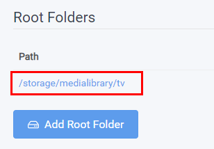

        `Series` => `Add New`

        

        

    ??? example "Radarr Examples"

        ###### Radarr

        `Settings` => `Media Managemen` => `Importing`

        

        `Settings` => `Media Managemen` => `Root Folders`

        

        `Movies` => `Add New`

        

        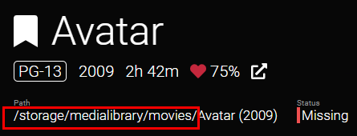

    ??? example "SABnzbd Examples"

        ###### SABnzbd

        `SABnzbd config` => `Folders`

        

        `SABnzbd config` => `Categories`

        

    ??? example "NZBGet Examples"

        ###### NZBGet

        `Settings` => `PATHS`

        

        `Settings` => `CATEGORIES`

        

    ??? example "qBittorrent Examples"

        ###### qBittorrent

        `Options` => `Downloads`

        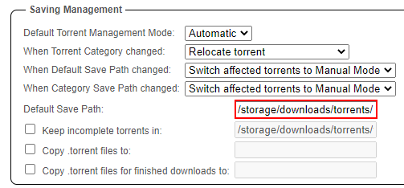

    ??? example "Deluge Example"

        ###### Deluge

        `Preferences` => `Downloads`

        

    ??? example "ruTorrent Examples"

        ###### ruTorrent

        `../config/rtorrent/config/rtorrent.rc` (path to your appdata)

        

        `Settings` => `Downloads`

        

        `Settings` => `Autotools`

        

??? summary "UnRaid"

    #### UnRaid

    !!! note

        The first thing you need to do is forget the suggested paths from the Spaceinvader One YouTube Tutorials,

        and don't use the predefined paths from the unraid templates.

        (Spaceinvader One YouTube guides are great to learn how to start with unraid or how to setup certain applications, and yes I did and still do use them. Probably the main reason why he's using those path is because they are predefined in the template)

    !!! attention

        To get Hardlinks and Atomic-Moves working with Unraid you will need to make use of **ONE** share with subfolders.

    ##### Create the main share

    For this example I'm using my own setup and preferred share `data`.

    Go to your dashboard and on the top select `shares` select `add share` .

    [](https://raw.githubusercontent.com/TRaSH-/Guides/master/docs/Misc/images/unraid-main-share.png){:target="_blank"}

    1. use `data`
    1. if you got a cache drive and want to make use of it put it on `Yes` or keep it disabled (Hardlinks will stay in tact if you're using the cache)
    1. click on `ADD SHARE`

    !!! note

        Keep in mind regarding the use of the Cache drive, The mover can't move files that are in use, like  when seeding with torrents. You will need to shutdown your client or stop/pause the torrents so the mover can move them to your Array.

        With Usenet  you won't have any issues.

    ##### Folder Structure

    On the host (Unraid) you will need to add `/mnt/user` before it. **So `/mnt/user/data`**

    The `data` folder has sub-folders for `torrents` and `usenet` and each of these have sub-folders for `tv`, `movie` and `music` downloads to keep things neat. The `media` folder has nicely named `TV`, `Movies` and `Music` sub-folders, this is your library and what you’d pass to Plex, Emby or JellyFin.

    These subfolders you need to create your self, you can use krusader or winscp to create them or any other way you prefer.

    ```none
    data
    ├── torrents
    │  ├── movies
    │  ├── music
    │  └── tv
    ├── usenet
    │  ├── movies
    │  ├── music
    │  └── tv
    └── media
       ├── movies
       ├── music
       └── tv
    ```

    *I'm using lower case on all folder on  purpose, being Linux is case sensitive.*

    ##### Setting up the containers

    After you created all the needed folders it's time to setup the paths in the docker containers.

    Go to your dashboard and select your docker container you want to edit or if you're starting fresh add the docker containers you want to use or prefer.

    Unraid makes it actually  pretty clear what's the Host Path and what's the Container Path.

    `Container Path:` => The path that will be used inside the container.

    `Host Path:` => The path on your Unraid Server (The Host).

    ##### Torrent clients

    qBittorrent, Deluge, ruTorrent

    

    `Container Path:` => `/data/torrents`

    `Host Path`: => `/mnt/user/data/torrents`

    !!! info

        The reason why we use `/data/torrents` for the torrent client is because it only needs access to the torrent files. In the torrent software settings, you’ll need to reconfigure paths and you can sort into sub-folders like `/data/torrents/{tv|movies|music}`.

    ```none
    data
    └── torrents
       ├── movies
       ├── music
       └── tv
    ```

    ##### Usenet clients

    NZBGet or SABnzbd

    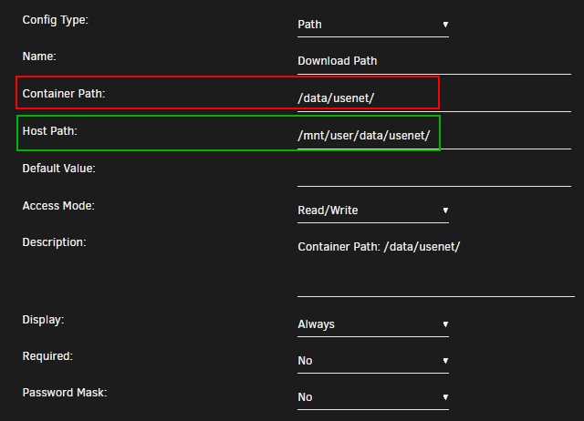

    `Container Path:` => `/data/usenet`

    `Host Path:` => `/mnt/user/data/usenet`

    !!! info

        The reason why we use `/data/usenet` for the usenet client is because it only needs access to the usenet files. In the usenet software settings, you’ll need to reconfigure paths and you can sort into sub-folders like `/data/usenet/{tv|movies|music}`.

    ```none
    data
    └── usenet
       ├── movies
       ├── music
       └── tv
    ```

    ##### The arr(s)

    Sonarr, Radarr and Lidarr

    

    `Container Path:` => `/data`

    `Host Path:` => `/mnt/user/data/`

    !!! info

        Sonarr, Radarr and Lidarr get's access to everything because the download folder(s) and media folder will look like and be one file system. Hard links will work and moves will be atomic, instead of copy + delete.

    ```none
    data
    ├── torrents
    │  ├── movies
    │  ├── music
    │  └── tv
    ├── usenet
    │  ├── movies
    │  ├── music
    │  └── tv
    └── media
       ├── movies
       ├── music
       └── tv
    ```

    ##### Media Server

    Plex, Emby, JellyFin and Bazarr

    

    `Container Path:` => `/data/media`

    `Host Path:` => `/mnt/user/data/media/`

    !!! info

        Plex, Emby, JellyFin and Bazarr only needs access to your media library, which can have any number of sub folders like Movies, Kids Movies, TV, Documentary TV and/or Music as sub folders.

    ```none
    data
    └── media
       ├── movies
       ├── music
       └── tv
    ```

    ##### Final Result

    [](https://raw.githubusercontent.com/TRaSH-/Guides/master/docs/Misc/images/unraid-final-result.png){:target="_blank"}

    Don't forget to look at the [Examples](#examples) how to setup the paths inside the containers.

??? summary "Synology"

    #### Synology

    !!! note

        Being I don't have a Synology myself and I kind of hate the Synology GUI for the dockers, I'm doing this with the use of docker-compose.

        This works like 10x faster then the GUI and after adding it shows up in the GUI.

        Thnx to faxity for the initial compose that I used to create the Synology Guide.

    We need to get some information that we need later to setup the docker-compose file.

    ##### PUID and PGID

    In order for the Docker container to access the shares on the Synology,
    we need to give it the same permissions as your main user who has access to those shares.
    For this we need to figure out the PUID and the PGID of the user having access to your shares.

    You will need to SSH into your Synology.
    If you didn't already enable it you need to do that first

    [](https://raw.githubusercontent.com/TRaSH-/Guides/master/docs/Misc/images/synology-control-panel.png){:target="_blank"}

    Then use a program like Putty and SSH to your Synology.

    Login if you get a popup asking if you want to trust the key,
    Just press `OK` or `ACCEPT`

    Enter the login information of your main Synology user account.

    

    Once logged in type `id`.
    This will show your UID (aka PUID).
    Which in this screenshot is `1026` for the administrator
    and the GID (aka PGID) which is `100` for the users group.
    Remember these values for later use.

    !!! note

        Yes we know it's not recommended to use the admin account but if you already know this then you wouldn't need to read this ;)

    !!! attention

        To get Hardlinks and Atomic-Moves working with your Synology you will need to make use of **ONE** share with subfolders.

    ##### Folder Structure

    For this example we're going to make use of a share called `data`.

    On the host (Synology) you will need to add `/volume1/` before it. So `/volume1/data`

    The `data` folder has sub-folders for `torrents` and `usenet` and each of these have sub-folders for `tv`, `movie` and `music` downloads to keep things neat. The `media` folder has nicely named `TV`, `Movies` and `Music` sub-folders, this is your library and what you’d pass to Plex, Emby or JellyFin.

    These subfolders you need to create your self.

    ```none
    data
    ├── torrents
    │  ├── movies
    │  ├── music
    │  └── tv
    ├── usenet
    │  ├── movies
    │  ├── music
    │  └── tv
    └── media
       ├── movies
       ├── music
       └── tv
    ```

    *I'm using lower case on all folder on  purpose, being Linux is case sensitive.*

    ##### Appdata

    Your appdata will be stored in `/volume1/docker/{appname}`
    These folders you need to create your self.

    A docker-compose file exist of 1 file that holds all the needed info of all your docker containers.
    this makes it easy to maintain and compare paths.

    Download this [synology-docker-compose.yml](https://gist.github.com/TRaSH-/6eddbc251b54b22acffba6baf5cbb5ed) to your `/volume1/docker/` location so you got your important stuff together.
    This docker-compose file will have the following docker containers included.

    - Radarr
    - Sonarr
    - Bazarr (Subtitle searcher and downloaded)
    - NZBGet
    - qBittorent
    - Plex
    - Watchtower (automatic docker container updater)

    I've added at the end of the Synology guide a few examples you can add/replace.

    ??? example "synology-docker-compose.yml"

        ``` yml
        version: "3.2"
        services:
        # Radarr - https://hotio.dev/containers/radarr/
          radarr:
            container_name: radarr
            image: ghcr.io/hotio/radarr:latest
            restart: unless-stopped
            logging:
              driver: json-file
            network_mode: bridge
            ports:
              - 7878:7878
            environment:
              - PUID=1026 # you must find out your PUID through SSH, type in terminal: id $user
              - PGID=100 # you must find out your PGID through SSH, type in terminal: id $user
              - TZ=Europe/Amsterdam # Change to your timezone
            volumes:
              - /etc/localtime:/etc/localtime:ro
              - /volume1/docker/radarr:/config # Change "/volume1/docker/radarr" with the path your config will be.
              - /volume1/data:/data # Change "/volume1/data" with the path where your library + torrent/usenet downloads both are.
        # Sonarr - https://hotio.dev/containers/sonarr/
          sonarr:
            container_name: sonarr
            image: ghcr.io/hotio/sonarr:nightly
            restart: unless-stopped
            logging:
              driver: json-file
            network_mode: bridge
            ports:
              - 8989:8989
            environment:
              - PUID=1026 # you must find out your PUID through SSH, type in terminal: id $user
              - PGID=100 # you must find out your PGID through SSH, type in terminal: id $user
              - TZ=Europe/Amsterdam # Change to your timezone
            volumes:
              - /etc/localtime:/etc/localtime:ro
              - /volume1/docker/sonarr:/config # Change "/volume1/docker/sonarr" with the path your config will be.
              - /volume1/data:/data # Change "/volume1/data" with the path where your library + torrent/usenet downloads both are.
        # Bazarr - https://hotio.dev/containers/bazarr/
          bazarr:
            container_name: bazarr
            image: ghcr.io/hotio/bazarr:nightly
            restart: unless-stopped
            logging:
              driver: json-file
            network_mode: bridge
            ports:
              - 6767:6767
            environment:
              - PUID=1026 # you must find out your PUID through SSH, type in terminal: id $user
              - PGID=100 # you must find out your PGID through SSH, type in terminal: id $user
              - TZ=Europe/Amsterdam # Change to your timezone
            volumes:
              - /etc/localtime:/etc/localtime:ro
              - /volume1/docker/bazarr:/config # Change "/volume1/docker/bazarr" with the path your config will be.
              - /volume1/data/media:/data/media # Change "/volume1/data/media" with the path where your library are(sonarr+radarr).
        # NZBGet - https://hotio.dev/containers/nzbget/
          nzbget:
            container_name: nzbget
            image: ghcr.io/hotio/nzbget:latest
            restart: unless-stopped
            logging:
              driver: json-file
            network_mode: bridge
            ports:
              - 6789:6789/tcp
            environment:
              - PUID=1026 # you must find out your PUID through SSH, type in terminal: id $user
              - PGID=100 # you must find out your PGID through SSH, type in terminal: id $user
              - TZ=Europe/Amsterdam # Change to your timezone
            volumes:
              - /etc/localtime:/etc/localtime:ro
              - /volume1/docker/nzbget:/config:rw # Change "/volume1/docker/nzbget" with the path your config will be.
              - /volume1/data/usenet:/data/usenet:rw # Change "/volume1/data/usenet" with the path your usenet data ends up in.
        # qBittorrent - https://docs.linuxserver.io/images/docker-qbittorrent
          qbittorrent:
            container_name: qbittorrent
            image: ghcr.io/linuxserver/qbittorrent
            restart: unless-stopped
            logging:
              driver: json-file
            network_mode: bridge
            ports:
              - 6881:6881
              - 6881:6881/udp
              - 8080:8080
            environment:
              - PUID=1026 # you must find out your PUID through SSH, type in terminal: id $user
              - PGID=100 # you must find out your PGID through SSH, type in terminal: id $user
              - TZ=Europe/Amsterdam # Change to your timezone
              - UMASK_SET=022
              - WEBUI_PORT=8080
            volumes:
              - /etc/localtime:/etc/localtime:ro
              - /volume1/docker/qbittorrent:/config:rw # Change "/volume1/docker/qbittorrent" with the path your config will be.
              - /volume1/data/torrents:/data/torrents:rw # Change "/volume1/data/torrents" with the path your usenet data ends up in.
        # Plex - https://hotio.dev/containers/plex/
          plex:
            container_name: plex
            image: ghcr.io/hotio/plex
            restart: unless-stopped
            logging:
              driver: json-file
            network_mode: bridge
            ports:
              - 32400:32400
            environment:
              - PUID=1026 # you must find out your PUID through SSH, type in terminal: id $user
              - PGID=100 # you must find out your PGID through SSH, type in terminal: id $user
              - TZ=Europe/Amsterdam # Change to your timezone
              - UMASK=002
              - ARGS=
              - DEBUG=no
              - PLEX_CLAIM=
              - ADVERTISE_IP=
              - ALLOWED_NETWORKS=
              - PLEX_PASS=no
            volumes:
              - /etc/localtime:/etc/localtime:ro
              - /volume1/docker/plex:/config:rw # Change "/volume1/docker/plex" with the path your config will be.
              - /volume1/data/media:/data/media:rw # Change "/volume1/data/media" with the path where your library are(sonarr+radarr).
              - /tmp:/transcode:rw
        # automatic docker container updater - https://github.com/containrrr/watchtower
          watchtower:
            container_name: watchtower
            image: containrrr/watchtower
            restart: unless-stopped
            logging:
              driver: json-file
            network_mode: bridge
            environment:
              - PUID=1026 # you must find out your PUID through SSH, type in terminal: id $user
              - PGID=100 # you must find out your PGID through SSH, type in terminal: id $user
              - TZ=Europe/Amsterdam # Change to your timezone
              - UMASK=022
              - WATCHTOWER_CLEANUP=true
              - WATCHTOWER_INCLUDE_STOPPED=false
              - WATCHTOWER_MONITOR_ONLY=false
              - WATCHTOWER_SCHEDULE=0 0 4 * * * # use cron to change update interval set at 4am.
              - WATCHTOWER_TIMEOUT=10s
            volumes:
              - /etc/localtime:/etc/localtime:ro
              - /var/run/docker.sock:/var/run/docker.sock
        ```

    ##### Changes you need to do

    1. PUID/PGID (this info you got earlier)
    1. TZ (Change to your timezone)

    !!! importand
        make sure you deleted/removed all your existing dockers from the GUI and also remove your native installs of these applications !!!

    ##### Run the Docker Compose

    ```bash
    sudo docker-compose up -d
    ```

    You will notice that all the images will be downloaded, and after that the containers will be started. If you get a error then look at the error what it says and try to fix it. If you still got issues then put your used docker-compose.yml on pastebin and join the guides-discord [here](https://trash-guides.info/discord){:target="_blank"} and provide the pastebin link with the error, have patience because of timezone differene.

    Don't forget to look at the [Examples](#examples) how to setup the paths inside the containers.

??? summary "Docker"

    #### Docker

    !!! note

        I'm not going to explain how to get dockers installed and running, I will only explain which folder structure we recommend you to uses and also provide a docker-compose.

        *I do recommend to use a non-root user with sudo permissions.*

    !!! attention

        It doesn't really matter which path you use for your media and appdata,

        the only thing you should  avoid is `/home`.

        Because user folders in `/home` are expected to have some restrictive permissions.

        It just could end up creating a permissions mess, so it's better to just avoid entirely.

    ##### Folder Structure

    For this example we're going to make use of a share called `data`.

    The `data` folder has sub-folders for `torrents` and `usenet` and each of these have sub-folders for `tv`, `movie` and `music` downloads to keep things neat. The `media` folder has nicely named `TV`, `Movies` and `Music` sub-folders, this is your library and what you’d pass to Plex, Emby or JellyFin.

    ```none
    data
    ├── torrents
    │  ├── movies
    │  ├── music
    │  └── tv
    ├── usenet
    │  ├── movies
    │  ├── music
    │  └── tv
    └── media
       ├── movies
       ├── music
       └── tv
    ```

    ??? summary "Breakdown of the Folder Structure"

        ##### Breakdown of the Folder Structure

        ###### Torrent clients

        qBittorrent, Deluge, ruTorrent

        The reason why we use `/data/torrents` for the torrent client is because it only needs access to the torrent files. In the torrent software settings, you’ll need to reconfigure paths and you can sort into sub-folders like `/data/torrents/{tv|movies|music}`.

        ```none
        data
        └── torrents
           ├── movies
           ├── music
           └── tv
        ```

        ###### Usenet clients

        NZBGet or SABnzbd

        The reason why we use `/data/usenet` for the usenet client is because it only needs access to the usenet files. In the usenet software settings, you’ll need to reconfigure paths and you can sort into sub-folders like `/data/usenet/{tv|movies|music}`.

        ```none
        data
        └── usenet
           ├── movies
           ├── music
           └── tv
        ```

        ###### The arr(s)

        Sonarr, Radarr and Lidarr

        Sonarr, Radarr and Lidarr get's access to everything because the download folder(s) and media folder will look like and be one file system. Hard links will work and moves will be atomic, instead of copy + delete.

        ```none
        data
        ├── torrents
        │  ├── movies
        │  ├── music
        │  └── tv
        ├── usenet
        │  ├── movies
        │  ├── music
        │  └── tv
        └── media
           ├── movies
           ├── music
           └── tv
        ```

        ###### Media Server

        Plex, Emby, JellyFin and Bazarr

        Plex, Emby, JellyFin and Bazarr only needs access to your media library, which can have any number of sub folders like Movies, Kids Movies, TV, Documentary TV and/or Music as sub folders.

        ```none
        data
        └── media
           ├── movies
           ├── music
           └── tv
        ```

    *I'm using lower case on all folder on  purpose, being Linux is case sensitive.*

    ##### Appdata

    Your appdata will be stored in `/docker/appdata/{appname}`
    These folders you need to create your self.

    A docker-compose file exist of 1 file that holds all the needed info of all your docker containers.
    this makes it easy to maintain and compare paths.

    Download this [docker-compose.yml](https://gist.github.com/TRaSH-/73a2250c2645dfe1c97c61bb5fc46d59) to your `/docker/` location so you got your important stuff together.
    This docker-compose file will have the following docker containers included.

    - Radarr
    - Sonarr
    - Bazarr (Subtitle searcher and downloaded)
    - NZBGet
    - qBittorent
    - Plex
    - Watchtower (automatic docker container updater)

    ??? example "docker-compose.yml"

        ``` yml
        version: "3.2"
        services:
        # Radarr - https://hotio.dev/containers/radarr/
          radarr:
            container_name: radarr
            image: ghcr.io/hotio/radarr:latest
            restart: unless-stopped
            logging:
              driver: json-file
            network_mode: bridge
            ports:
              - 7878:7878
            environment:
              - PUID=1000 # you must find out your PUID through SSH, type in terminal: id $user
              - PGID=1000 # you must find out your PGID through SSH, type in terminal: id $user
              - TZ=Europe/Amsterdam # Change to your timezone
            volumes:
              - /etc/localtime:/etc/localtime:ro
              - /docker/appdata/radarr:/config # Change "/docker/appdata/radarr" with the path your config will be.
              - /data:/data # Change "/data" with the path where your library + torrent/usenet downloads both are.
        # Sonarr - https://hotio.dev/containers/sonarr/
          sonarr:
            container_name: sonarr
            image: ghcr.io/hotio/sonarr:nightly
            restart: unless-stopped
            logging:
              driver: json-file
            network_mode: bridge
            ports:
              - 8989:8989
            environment:
              - PUID=1000 # you must find out your PUID through SSH, type in terminal: id $user
              - PGID=1000 # you must find out your PGID through SSH, type in terminal: id $user
              - TZ=Europe/Amsterdam # Change to your timezone
            volumes:
              - /etc/localtime:/etc/localtime:ro
              - /docker/appdata/sonarr:/config # Change "/docker/appdata/sonarr" with the path your config will be.
              - /data:/data # Change "/data" with the path where your library + torrent/usenet downloads both are.
        # Bazarr - https://hotio.dev/containers/bazarr/
          bazarr:
            container_name: bazarr
            image: ghcr.io/hotio/bazarr:nightly
            restart: unless-stopped
            logging:
              driver: json-file
            network_mode: bridge
            ports:
              - 6767:6767
            environment:
              - PUID=1000 # you must find out your PUID through SSH, type in terminal: id $user
              - PGID=1000 # you must find out your PGID through SSH, type in terminal: id $user
              - TZ=Europe/Amsterdam # Change to your timezone
            volumes:
              - /etc/localtime:/etc/localtime:ro
              - /docker/appdata/bazarr:/config # Change "/docker/appdata/bazarr" with the path your config will be.
              - /data/media:/data/media # Change "/data/media" with the path where your library are(sonarr+radarr).
        # NZBGet - https://hotio.dev/containers/nzbget/
          nzbget:
            container_name: nzbget
            image: ghcr.io/hotio/nzbget:latest
            restart: unless-stopped
            logging:
              driver: json-file
            network_mode: bridge
            ports:
              - 6789:6789/tcp
            environment:
              - PUID=1000 # you must find out your PUID through SSH, type in terminal: id $user
              - PGID=1000 # you must find out your PGID through SSH, type in terminal: id $user
              - TZ=Europe/Amsterdam # Change to your timezone
            volumes:
              - /etc/localtime:/etc/localtime:ro
              - /docker/appdata/nzbget:/config:rw # Change "/docker/appdata/nzbget" with the path your config will be.
              - /data/usenet:/data/usenet:rw # Change "/data/usenet" with the path your usenet data ends up in.
        # qBittorrent - https://docs.linuxserver.io/images/docker-qbittorrent
          qbittorrent:
            container_name: qbittorrent
            image: ghcr.io/linuxserver/qbittorrent
            restart: unless-stopped
            logging:
              driver: json-file
            network_mode: bridge
            ports:
              - 6881:6881
              - 6881:6881/udp
              - 8080:8080
            environment:
              - PUID=1000 # you must find out your PUID through SSH, type in terminal: id $user
              - PGID=1000 # you must find out your PGID through SSH, type in terminal: id $user
              - TZ=Europe/Amsterdam # Change to your timezone
              - UMASK_SET=022
              - WEBUI_PORT=8080
            volumes:
              - /etc/localtime:/etc/localtime:ro
              - /docker/appdata/qbittorrent:/config:rw # Change "/docker/appdata/qbittorrent" with the path your config will be.
              - /data/torrents:/data/torrents:rw # Change "/data/torrents" with the path your usenet data ends up in.
        # Plex - https://hotio.dev/containers/plex/
          plex:
            container_name: plex
            image: ghcr.io/hotio/plex
            restart: unless-stopped
            logging:
              driver: json-file
            network_mode: bridge
            ports:
              - 32400:32400
            environment:
              - PUID=1000 # you must find out your PUID through SSH, type in terminal: id $user
              - PGID=1000 # you must find out your PGID through SSH, type in terminal: id $user
              - TZ=Europe/Amsterdam # Change to your timezone
              - UMASK=002
              - ARGS=
              - DEBUG=no
              - PLEX_CLAIM=
              - ADVERTISE_IP=
              - ALLOWED_NETWORKS=
              - PLEX_PASS=no
            volumes:
              - /etc/localtime:/etc/localtime:ro
              - /docker/appdata/plex:/config:rw # Change "/docker/appdata/plex" with the path your config will be.
              - /data/media:/data/media:rw # Change "/data/media" with the path where your library are(sonarr+radarr).
              - /tmp:/transcode:rw
        # automatic docker container updater - https://github.com/containrrr/watchtower
          watchtower:
            container_name: watchtower
            image: containrrr/watchtower
            restart: unless-stopped
            logging:
              driver: json-file
            network_mode: bridge
            environment:
              - PUID=1000 # you must find out your PUID through SSH, type in terminal: id $user
              - PGID=1000 # you must find out your PGID through SSH, type in terminal: id $user
              - TZ=Europe/Amsterdam # Change to your timezone
              - UMASK=022
              - WATCHTOWER_CLEANUP=true
              - WATCHTOWER_INCLUDE_STOPPED=false
              - WATCHTOWER_MONITOR_ONLY=false
              - WATCHTOWER_SCHEDULE=0 0 4 * * * # use cron to change update interval set at 4am.
              - WATCHTOWER_TIMEOUT=10s
            volumes:
              - /etc/localtime:/etc/localtime:ro
              - /var/run/docker.sock:/var/run/docker.sock
        ```

    ##### Changes you need to do

    1. Change the PUID/PGID.
    1. TZ (Change to your timezone)

    ##### Run the Docker Compose

    ```bash
    sudo docker-compose up -d
    ```

    You will notice that all the images will be downloaded, and after that the containers will be started. If you get a error then look at the error what it says and try to fix it. If you still got issues then put your used docker-compose.yml on pastebin and join the guides-discord [here](https://trash-guides.info/discord){:target="_blank"} and provide the pastebin link with the error, have patience because of timezone differene.

    Don't forget to look at the [Examples](#examples) how to setup the paths inside the containers.

------

### Examples

!!! info

    Pick one path layout and use it for all of them.

    It doesn't matter if you prefer to use `/data`, `/shared`, `/storage` or whatever.

    The screenshots in the examples are using the following root path `/data`

- [Sonarr](#sonarr)
- [Radarr](#radarr)
- [SABnzbd](#sabnzbd)
- [NZBGet](#nzbget)
- [qBittorrent](#qbittorent)
- [Deluge](#deluge)
- [ruTorrent](#rutorrent)

??? example "Sonarr Examples"

    #### Sonarr

    `Settings` => `Media Managemen` => `Importing`

    

    `Settings` => `Media Managemen` => `Root Folders`

    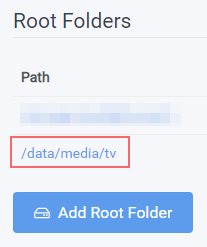

    `Series` => `Add New`

    

    

??? example "Radarr Examples"

    #### Radarr

    `Settings` => `Media Managemen` => `Importing`

    

    `Settings` => `Media Managemen` => `Root Folders`

    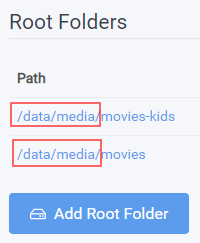

    `Movies` => `Add New`

    

    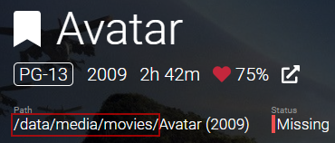

??? example "SABnzbd Examples"

    #### SABnzbd

    `SABnzbd config` => `Folders`

    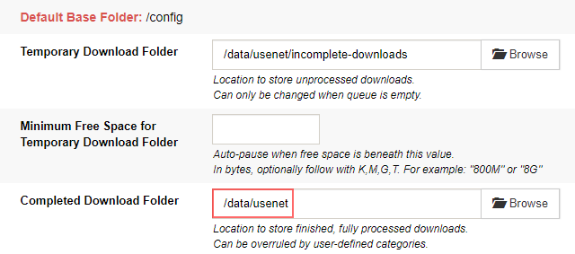

    `SABnzbd config` => `Categories`

    

??? example "NZBGet Examples"

    #### NZBGet

    `Settings` => `PATHS`

    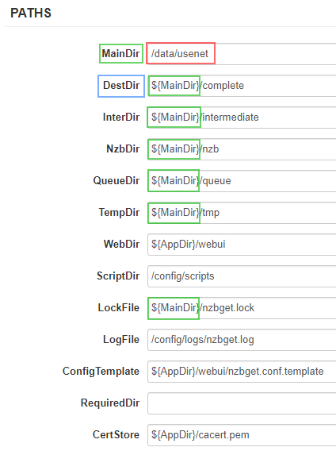

    `Settings` => `CATEGORIES`

    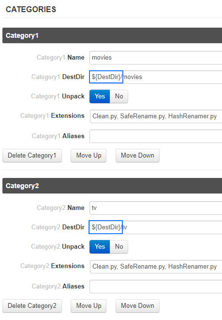

??? example "qBittorrent Examples"

    #### qBittorrent

    `Options` => `Downloads`

    

??? example "Deluge Example"

    #### Deluge

    `Preferences` => `Downloads`

    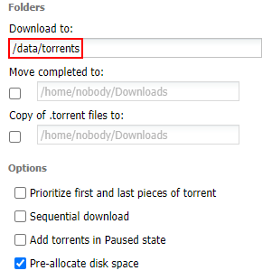

??? example "ruTorrent Examples"

    #### ruTorrent

    `../config/rtorrent/config/rtorrent.rc` (path to your appdata)

    

    `Settings` => `Downloads`

    

    `Settings` => `Autotools`

    

------

Big Thnx to [fryfrog](https://github.com/fryfrog){:target="_blank"} for his [Docker Guide](https://wiki.servarr.com/Docker_Guide){:target="_blank"} that I used as basis for this guide.
