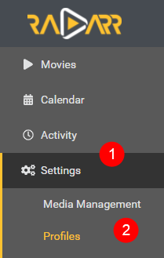
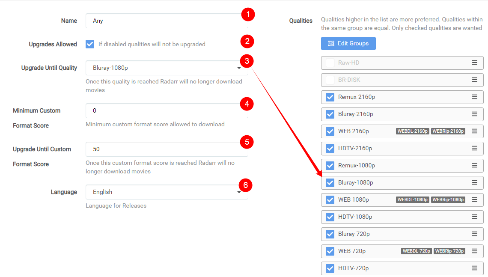
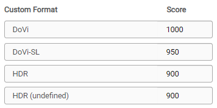
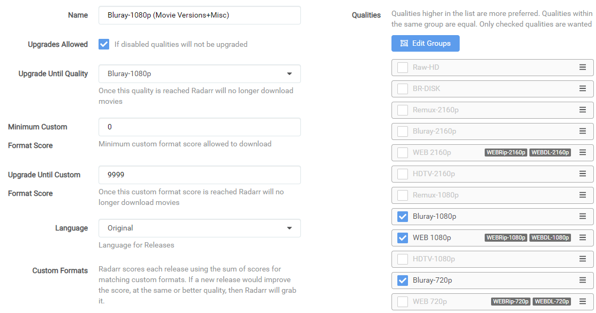
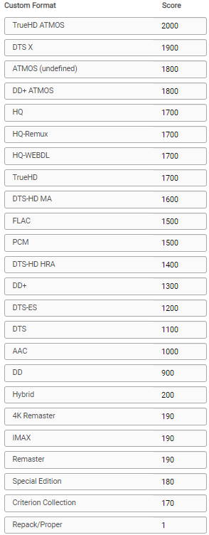
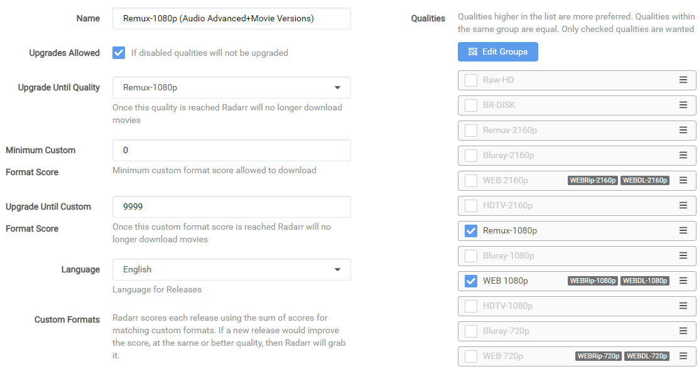
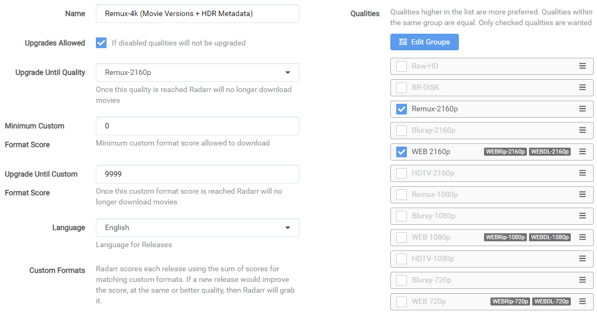

# How to setup Custom Formats

So what's the best way to setup the Custom Profiles and which one to use with which scores?

There isn't a best scores setup, being that everyone has its own personal preference what they prefer Audio or Video or perhaps both.

But being I still get allot of questions about it I decided to create a Guide for it.

Here I will try to explain with some personal used examples how to make the most use of Custom Formats. That you can use to get a idea how to setup yours.

------

!!! important

    I also suggest to change the Propers and Repacks settings in Radarr !!!

    Instructions can be found [HERE](#proper-and-repacks)

## Basics

!!! note

    Custom formats are implemented within and have their impact controlled by Quality Profiles. The Upgrade Until score prevents upgrading once a release with this desired score has been downloaded. A score of 0 results in the custom format being informational only. The Minimum score requires releases to reach this threshold otherwise they will be rejected. Custom formats that match with undesirable attributes should be given a negative score to lower their appeal. Outright rejections should be given a negative score low enough that even if all of the other formats with positive scores were added, the score would still fall below the minimum.

First the basics where we going to explain where to setup the Custom Formats after you've added them, what we've explained in [How to import Custom Formats](/Radarr/Radarr-import-custom-formats){:target="_blank" rel="noopener noreferrer"}.
And a short description what the settings means.

`Settings` => `Profiles`

Then select the profile that you use/prefer.

!!! note
    Radarr Custom Format can be set per profile and isn't global

1. Profile name.
1. If you want that Radarr will upgrade till the quality set in (3.).
1. Upgrade till the selected Quality.
1. The `Minimum Custom Format Score` allowed to download. [More Info](#minimum-custom-format-score)
1. Keep upgrading Custom Format till this score is reached. (setting this to `0` means no upgrades will happen based on Custom Formats)
1. Your preferred language profile for your Releases.

In your chosen profile at the bottom you will see the added Custom Profiles where you can start setting up the scores.

------

## Overall tips and suggestions

!!! attention
    Keep in mind Custom Formats are made to fine tune your Quality Profile

    Generally Quality Trumps All

    The current logic can be found [HERE](https://github.com/Radarr/Radarr/blob/develop/src/NzbDrone.Core/DecisionEngine/DownloadDecisionComparer.cs){:target="_blank" rel="noopener noreferrer"} As of 1/19/2021 the logic is as follows

    1. Quality
    1. Custom Format Score
    1. Protocol
    1. Indexer Priority
    1. Indexer Flags
    1. Peers (If Torrent)
    1. Age (If Usenet)
    1. Size

My suggestion is to create tiers of scores based on what things matter to you.

Personally I would only add the Custom Formats that do what you actually prefer especially in the beginning, including the [Releases you should avoid](#releases-you-should-avoid)

If you got any questions or aren't sure what to add just Click the chat badge to join the Discord Channel where you can ask your questions directly.

{:target="_blank" rel="noopener noreferrer"}

------

## Examples

Here I will show how to make the most use of Custom Formats and show some personal examples that I'm using. That you can use to get a idea how to setup yours.

All these examples make use of the [Collection of Custom Formats](/Radarr/Radarr-collection-of-custom-formats/)

??? FAQ "Which overall scoring scheme do you use ?"

    ### Which overall scoring scheme do you use

    - **Advanced Audio** 500 for the highest with steps of 10 down.
    - **HDR Metadata** 300 for the highest with steps of 10 down.
    - **Movie Versions** 200 for the highest with steps of 10 down.
    - **Misc** 100 with steps of 10 down.
    - **Releases you should avoid** -9999

    If you notice that some scores are missing between the different Quality Profiles examples it's because I decided to be consistent with the scoring. Meaning a certain Custom Format has in every used Quality Profile the same score.

------

### Releases you should avoid

In my opinion this is a must for every Quality Profile you use, all these Custom Formats make sure you don't get Low Quality Releases.

!!! info
    Add all of the following Custom Formats as `-1000` or even `-9999`

??? example "Breakdown and Why"

    - **BR-DISK** This is a custom format to help Radarr recognize & ignore BR-DISK (ISO's and Blu-ray folder structure) in addition to the standard BR-DISK quality.
    - **EVO except WEB-DL** This group is often banned for the low quality Blu-ray releases, but their WEB-DL are okay.
    - **Low Quality Releases** A collection of known Low Quality groups that are often banned from the the top trackers because the lack of quality or other reasons.
    - **720/1080p no x265** This blocks/ignores 720/1080p releases that are encoded in x265 - More info [HERE](/Misc/x265-4k){:target="_blank" rel="noopener noreferrer"}.
    - **3D** Is 3D still a thing for home use ?

??? success "example"
    

!!! tip
    You might even can consider to add [Multi](/Radarr/Radarr-collection-of-custom-formats/#multi){:target="_blank" rel="noopener noreferrer"} if you want to make sure you don't grab releases with often foreign audio.

------

#### Prefer Advanced Audio

Lets say you prefer HD audio (with object metadata)

Then we would use the following order.

`Basic Dolby Digital (DD) < AAC < Basic DTS (DTS) < DTS-ES < Dolby Digital Plus (DD+) < DTS-HD HRA < PCM = FLAC < DTS-HD MA < TrueHD < DD+ ATMOS = ATMOS (undefined) < DTS X < TrueHD ATMOS`

In this example above I have lossy Atmos over lossless DTS because the object metadata matters more to me over lossy vs lossless

??? success "example"

    

------

#### Prefer HDR Metadata

Lets say you prefer HDR metadata

Then we would use the following order.

`HDR (undefined) = HDR < Dolby Vision`

I didn't add `Dolby Vision (Single Layer)` being most of the releases are already replaced by real `Dolby Vision` releases, If you still want to add it put it between `HDR` and `Dolby Vision` so they still can get upgraded.

Also I didn't add `10 Bit` being 4k releases are 99% 10bit anyway.

??? success "example"

    

------

#### Prefer HQ Encodes

If you prefer HQ Encodes (Bluray-720/1080/2160p)

I suggest to first follow the [Quality Settings (File Size)](/Radarr/Radarr-Quality-Settings-File-Size){:target="_blank" rel="noopener noreferrer"}
If you think the sizes are to big to your preference then stop reading and see if the other tutorials are helpful for you. :bangbang:

For this Quality Profile we're going to make use of `Movie Versions`, `Misc (-1000)` and `Misc`

 :bangbang: **Make sure you add the [Releases you should avoid](#releases-you-should-avoid)** :bangbang:

I decided not to add `Audio Advanced` Custom Formats to the encodes profile being with encodes I prefer higher video quality, If I want also the HD audio formats I would go for the Remuxes.

The Custom Formats we're going to use and scoring.

And you use the following main settings in your profile.

!!! info

    Make sure you don't check the BR-DISK, The reason why I didn't select the WEB-DL 720p is because you will find hardly any releases that aren't done as 1080p WEB-DL

The following workflow will be applied:

- It will download WEB-DL 1080p for the streaming movies you see more often lately.
- It will upgrade till Bluray-1080p when available.
- The downloaded media will be upgraded to any of the added Custom Formats till a score of 9999.

So why such a ridiculous high `Upgrade Until Custom` and not a score of `100` ?
Because I'm to lazy to calculate the maximum for every of my used Quality Profile and I want it to upgrade to the highest as possible anyway.

!!! info

    If you prefer 2160/4K encodes you might consider to enable HDR and set the `Upgrade Until Quality` to Bluray-2160p

------

#### Remux-1080p

If you prefer 1080p Remuxes (Remux-1080p)

I suggest to first follow the [Quality Settings (File Size)](/Radarr/Radarr-Quality-Settings-File-Size){:target="_blank" rel="noopener noreferrer"}
If you think the sizes are to big to your preference then stop reading and see if the other tutorials are helpful for you. :bangbang:

For this Quality Profile we're going to make use of `Audio Advanced`, `Movie Versions`, `Misc (-1000)` and `Misc`

 :bangbang: **Make sure you add the [Releases you should avoid](#releases-you-should-avoid)** :bangbang:

The Custom Formats we're going to use and scoring.

And you use the following main settings in your profile.

!!! info

    Make sure you don't check the BR-DISK, The reason why I didn't select the WEB-DL 720p is because you will find hardly any releases that aren't done as 1080p WEB-DL

The following workflow will be applied:

- It will download WEB-DL 1080p for the streaming movies you see more often lately.
- It will upgrade till Remux-1080p when available.
- The downloaded media will be upgraded to any of the added Custom Formats till a score of 9999.

So why such a ridiculous high `Upgrade Until Custom` and not a score of `500` ?
Because I'm to lazy to calculate the maximum for every of my used Quality Profile and I want it to upgrade to the highest as possible anyway.

------

#### Remux-2160p

If you prefer 2160p Remuxes (Remux-2160p)

I suggest to first follow the [Quality Settings (File Size)](/Radarr/Radarr-Quality-Settings-File-Size){:target="_blank" rel="noopener noreferrer"}
If you think the sizes are to big to your preference then stop reading and see if the other tutorials are helpful for you. :bangbang:

For this Quality Profile we're going to make use of `Audio Advanced`,  `HDR Metadata`,`Movie Versions`, `Misc (-1000)` and `Misc`

 :bangbang: **Make sure you add the [Releases you should avoid](#releases-you-should-avoid)** :bangbang:

The Custom Formats we're going to use and scoring.

And you use the following main settings in your profile.

!!! info

    Make sure you don't check the BR-DISK.

The following workflow will be applied:

- It will download WEB-DL 2160p for the streaming movies you see more often lately.
- It will upgrade till Remux-2160p when available.
- The downloaded media will be upgraded to any of the added Custom Formats till a score of 9999.

So why such a ridiculous high `Upgrade Until Custom` and not a score of `500` ?
Because I'm to lazy to calculate the maximum for every of my used Quality Profile and I want it to upgrade to the highest as possible anyway.

------

## FAQ and Tips

### Proper and Repacks

??? tip "Proper and Repacks"

    I also suggest to change the Propers and Repacks settings in Radarr

    `Media Management` => `File Management` to `Do Not Prefer` and use the [Repack/Proper](/Radarr/Radarr-collection-of-custom-formats/#repack-proper) Custom Format.

    

    This way you make sure the Custom Formats preferences will be used and not ignored.

### Custom Formats to avoid certain releases

??? FAQ "How to use a Custom Formats to avoid certain releases?"

    For Custom Formats you really want to avoid, set it to something really low like `-1000` or even `-9999` and not something like `-10`.
    Being when you add a Custom Format what you prefer and you set it to something like `+10` it could happen that for example the `BR-DISK` will be downloaded (-10)+(+10)=0 and if your `Minimum Custom Format Score` is set at `0`.

### Audio vs Audio Advanced

??? FAQ "What's the difference between Audio vs Audio Advanced?"

    What's the biggest difference between these two ?

    The Custom Formats in the `Audio` are kinda global and not specific based on the best audio format.

    Personally I recommend to use the `Audio Advanced` they are already ordered from high to low if you prefer HD audio (with object metadata)

    !!! warning

        Don't use `Audio` Custom Format in combination with the `Audio Advanced` Custom Formats.

### Custom Formats with a score of 0

??? FAQ "What do Custom Formats with a score of 0 do?"

    All Custom Formats with a score of 0 are pure informational and don't do anything.

### Minimum Custom Format Score

??? info "Minimum Custom Format Score"

    Some people suggest not to use minus score for your Custom Formats and set this option to a higher score then 0.

    The reason why I don't prefer/use this is because you could limit your self when some new groups or what ever will be released.

    Also it makes it much more clear what you prefer and what you want to avoid.

### Audio Channels

??? info "Audio Channels"

    Personally I wouldn't add the audio channels Custom Formats being you could limit your self in the amount of releases you're able to get. Only use this if you got specific reasons that you need them.

    Using it with any kind of Remuxes Quality Profile is useless in my opinion being that 99% of all remuxes are multi audio anyway. and you can better score using the `Audio Advanced` Custom Formats

### Avoid using the x264/x265 Custom Format

??? tip "Avoid using the x264/x265 Custom Format"

    If possible avoid using the x264/x265 Custom Format with a score, it's smarter to use the [720/1080p no x265](/Radarr/Radarr-collection-of-custom-formats/#7201080p-no-x265) Custom Format.

    Something like 95% of video files are x264 and have much better direct play support. If you have more than a couple users, you will notice much more transcoding.

    Use x265 only for 4k releases and the [720/1080p no x265](/Radarr/Radarr-collection-of-custom-formats/#7201080p-no-x265) makes sure you still can get the x265 releases.

## THNX

A big thnx to [rg9400](https://github.com/rg9400) for providing me with info needed to create the Tips section.
